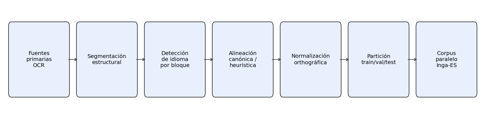
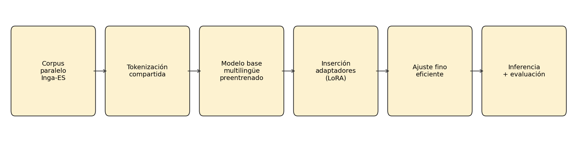
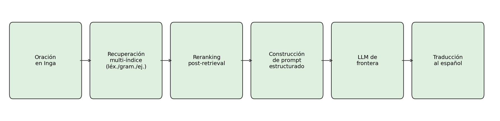
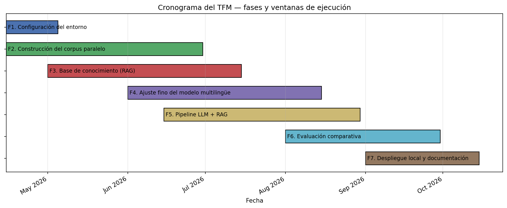
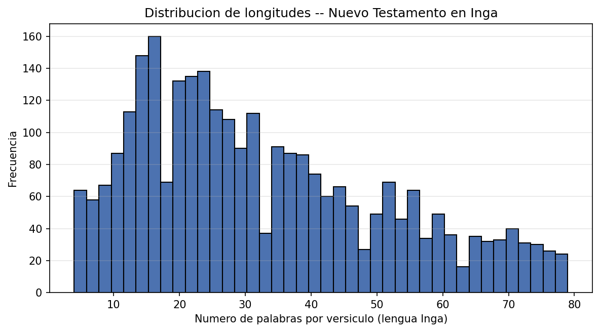

<!-- PORTADA -->

# Universidad Internacional de La Rioja
## Escuela Superior de Ingeniería y Tecnología
## Máster Universitario en Inteligencia Artificial

**Diseño e implementación de un sistema comparativo de traducción automática Inga-Español mediante ajuste fino de modelos multilingües y recuperación aumentada de información sobre modelos de lenguaje de frontera**

Trabajo fin de estudio presentado por:
- Eslava, Daniel
- Santos, William

**Tipo de trabajo:** Piloto experimental
**Director:** Víctor David Larco Torres
**Fecha:** 22 de abril de 2026

---

## Resumen

El presente trabajo propone el diseño y la implementación de un sistema comparativo de traducción automática para el par lingüístico Inga-Español, como aporte a la preservación digital de la lengua Inga del Putumayo, variante de la familia quechua hablada por aproximadamente 18.000 personas en el suroccidente de Colombia. El sistema adopta dos aproximaciones complementarias: por un lado, la adaptación de un modelo de traducción automática multilingüe preentrenado mediante técnicas de ajuste fino eficiente en parámetros, aprovechando el conocimiento de lenguas quechuas emparentadas como base de transferencia; por otro, la construcción de un pipeline de traducción basado en un modelo de lenguaje de frontera potenciado con recuperación aumentada de información, apoyado en una base de conocimiento lingüístico estructurada en tres índices independientes (léxico, gramatical y de ejemplos paralelos). En la presente Entrega 1 se documenta el planteamiento del problema, la revisión del estado del arte con énfasis en trabajos recientes sobre Quechua como antecedente más cercano al Inga, la definición de objetivos específicos con criterio SMART, la metodología organizada en siete fases y los avances iniciales del proyecto: configuración del entorno computacional sobre Apple Silicon, inventario cuantificado de 1.094 páginas de material lingüístico primario procedente de cinco recursos (diccionario, gramática pedagógica, apéndice morfosintáctico, Nuevo Testamento en Inga y narrativas orales), y extracción inicial de un corpus compuesto por 3.093 segmentos del Nuevo Testamento y 817 entradas léxicas estructuradas. El aporte original del trabajo se sustenta en la cobertura bidialectal , Alto Putumayo y Medio Putumayo, y en la comparación directa de ambas aproximaciones sobre la misma lengua, aspectos no abordados previamente en la literatura académica.

**Palabras clave:** traducción automática, lenguas indígenas, Inga, transfer learning, recuperación aumentada de información

---

## Abstract

This work proposes the design and implementation of a comparative machine translation system for the Inga-Spanish language pair, as a contribution to the digital preservation of the Inga language of Putumayo, a Quechua variant spoken by approximately 18,000 people in southwestern Colombia. The system adopts two complementary approaches: first, adapting a pretrained multilingual machine translation model through parameter-efficient fine-tuning techniques, leveraging knowledge of related Quechua languages as a transfer base; second, building a translation pipeline based on a frontier language model enhanced with retrieval-augmented generation, supported by a structured linguistic knowledge base organized in three independent indices (lexical, grammatical, and parallel-example). This first deliverable documents the problem statement, the state-of-the-art review with emphasis on recent work on Quechua as the closest antecedent, the SMART-based definition of specific objectives, the seven-phase methodology, and the project's initial progress: configuration of the computational environment on Apple Silicon, quantified inventory of 1,094 pages of primary linguistic material drawn from five resources (dictionary, pedagogical grammar, morphosyntactic appendix, Inga New Testament, and oral narratives), and initial extraction of a corpus comprising 3,093 New Testament segments and 817 structured lexical entries. The original contribution of the work rests on its bidialectal coverage , Alto Putumayo and Medio Putumayo, and on the direct comparison of both approaches on the same language, aspects not previously addressed in the academic literature.

**Keywords:** machine translation, indigenous languages, Inga (Quechua), transfer learning, retrieval-augmented generation

---

## Índice de contenidos

[Autogenerado en Word]

## Índice de figuras

[Autogenerado en Word]

## Índice de tablas

[Autogenerado en Word]

---

## Organización del trabajo en grupo

### Partes que aborda el TFE

El presente Trabajo Fin de Máster se desarrolla en modalidad grupal por dos estudiantes y aborda dos contribuciones técnicas autocontenidas que, de forma individual, podrían constituir un trabajo de investigación independiente, además de un componente de infraestructura compartida. Esta partición responde al requisito de la Universidad de que cada integrante realice un aporte técnico suficiente para la obtención del título, tal como se establece en la plantilla oficial para trabajos grupales.

La primera contribución, a cargo de **William Santos**, consiste en la adaptación de un modelo de traducción automática multilingüe preentrenado al par lingüístico Inga-Español mediante técnicas de ajuste fino eficiente en parámetros, aprovechando el conocimiento de lenguas quechuas emparentadas que el modelo ya incorpora como base para la transferencia cross-lingual. Este componente incluye además la curación del corpus bidialectal , Alto Putumayo y Medio Putumayo, labor que se nutre del acceso comunitario del integrante a hablantes nativos en Mocoa, así como la validación lingüística de las salidas del sistema.

La segunda contribución, a cargo de **Daniel Eslava**, consiste en el diseño e implementación de un sistema de traducción basado en un modelo de lenguaje de frontera potenciado con recuperación aumentada de información. El sistema utiliza una base de conocimiento lingüístico del Inga estructurada en tres índices independientes , léxico, gramatical y de ejemplos paralelos, que se consultan dinámicamente durante la inferencia. Este componente incluye adicionalmente el diseño del marco de evaluación comparativa entre ambas aproximaciones, así como la orquestación del pipeline completo de inferencia.

La infraestructura compartida entre ambos integrantes comprende la construcción y curación del corpus paralelo, la normalización ortográfica, la validación con hablantes nativos y el análisis de resultados en la fase de evaluación final.

### Distribución y estructura de la memoria

La estructura de responsabilidades para la redacción de la memoria se detalla en la Tabla 1.

**Tabla 1**
*Organización del trabajo en grupo en la redacción de la memoria*

| Apartado de la memoria | Responsables |
|---|---|
| Introducción | William Santos y Daniel Eslava |
| Contexto y estado del arte | William Santos (secciones sobre NMT y ajuste fino eficiente), Daniel Eslava (secciones sobre LLMs y RAG) |
| Objetivos y metodología de trabajo | William Santos y Daniel Eslava |
| Marco normativo | William Santos (aspectos comunitarios), Daniel Eslava (licenciamiento de datos y modelos) |
| Desarrollo, Adaptación del modelo multilingüe | William Santos |
| Desarrollo, Pipeline LLM con recuperación aumentada | Daniel Eslava |
| Desarrollo, Corpus e infraestructura experimental | William Santos y Daniel Eslava |
| Conclusiones | William Santos y Daniel Eslava |

*Nota.* Elaboración propia.

### Mecanismos de coordinación empleados

El trabajo remoto entre los dos integrantes, ubicados en Mocoa (Putumayo) y Cali (Valle del Cauca), exige mecanismos de coordinación formales que aseguren la trazabilidad de las decisiones técnicas y la consistencia de los entregables. Para ello se adoptan los siguientes instrumentos.

En primer lugar, se establece un repositorio compartido en la plataforma GitHub para el código fuente, los *notebooks* de experimentación y la documentación del proyecto, con control de versiones distribuido y revisión cruzada de las contribuciones mediante *pull requests* antes de su integración a la rama principal. En segundo lugar, se utiliza GitHub Projects para la gestión de tareas operativas, con tableros que reflejan las siete fases del proyecto descritas en el Capítulo 3. En tercer lugar, se planifican reuniones síncronas semanales por videoconferencia para revisión de avances, toma de decisiones arquitecturales y resolución de bloqueos; cada reunión produce un acta breve que se archiva en el repositorio. En cuarto lugar, se emplea un gestor bibliográfico compartido (Zotero) que mantiene sincronizadas las referencias verificadas del proyecto, con identificadores estables (DOI, arXiv, ACL Anthology) asociados a cada entrada. Finalmente, la memoria se redacta de forma colaborativa con asignación clara de secciones según la distribución mostrada en la Tabla 1 y revisión cruzada completa antes de cada entrega formal.

---

# 1. Introducción

## 1.1 Motivación

La lengua Inga, perteneciente a la familia lingüística quechua, constituye un sistema cultural vivo sostenido por aproximadamente 18.000 hablantes del pueblo Inga asentado en el departamento del Putumayo, al suroccidente de Colombia. Sus comunidades se distribuyen principalmente entre dos zonas dialectales: el Alto Putumayo, que abarca el Valle de Sibundoy con los corregimientos de San Andrés y los municipios de Santiago y Colón; y el Medio Putumayo, que comprende Mocoa, Condagua, Yunguillo y Puerto Guayuyaco. A pesar de seguir siendo una lengua de uso cotidiano en el hogar y en la vida comunitaria, el Inga atraviesa un proceso sostenido de desplazamiento frente al español, que opera como lengua dominante en los ámbitos educativo, institucional y digital. Este fenómeno no amenaza únicamente a un sistema de comunicación, sino a toda una cosmovisión y un sistema de conocimiento ancestral transmitido oralmente. La UNESCO (2022), en el *World Atlas of Languages*, advierte que las lenguas indígenas del mundo enfrentan un riesgo de desaparición sin precedentes, y por ello la Organización de las Naciones Unidas ha proclamado la Década Internacional de las Lenguas Indígenas 2022-2032.

Frente a esta realidad, la brecha digital adopta hoy la forma de una exclusión tecnológica. Los grandes traductores comerciales , como Google Translate y DeepL, no contemplan la lengua Inga en su catálogo. En mayo de 2022, Google Translate incorporó Quechua sureño a su conjunto de idiomas soportados, pero la variante Inga del Putumayo continúa excluida. Los escasos recursos digitales disponibles se limitan al *Diccionario Inga* del Valle de Sibundoy (Tandioy Jansasoy et al., 1997), a materiales pedagógicos del Instituto Lingüístico de Verano y a los recursos del programa *Inga Rimangapa Samuichi* de Indiana University, todos ellos con difusión restringida y sin integración computacional. La literatura reciente sobre procesamiento del lenguaje natural en lenguas indígenas de América Latina documenta con claridad este rezago sistemático (Tonja et al., 2024); los primeros esfuerzos de traducción automática para lenguas indígenas colombianas, incluida el Inga, aparecen con Prieto et al. (2024), quienes construyen el primer corpus paralelo documentado. Esta ausencia tecnológica profundiza la brecha entre las lenguas hegemónicas y las lenguas indígenas, y niega al Inga un espacio en el ecosistema digital contemporáneo.

Existe, sin embargo, un marco normativo y una ventana de oportunidad tecnológica que habilitan una respuesta viable desde la inteligencia artificial. La Constitución Política de Colombia (Asamblea Nacional Constituyente de Colombia, 1991) reconoce en su Artículo 10 la oficialidad territorial de las lenguas y dialectos de los grupos étnicos del país, y la Ley 1381 de 2010 desarrolla los derechos lingüísticos de estas comunidades, estableciendo principios explícitos de reconocimiento, fomento, protección, uso, preservación y fortalecimiento (Congreso de la República de Colombia, 2010). Los avances recientes en traducción automática multilingüe masiva, en técnicas de transfer learning desde lenguas emparentadas y en modelos de lenguaje de frontera potenciados con recuperación aumentada de información abren la posibilidad de producir herramientas utilizables para lenguas que hasta hace pocos años eran consideradas intratables. Las consideraciones éticas y comunitarias de este tipo de iniciativas se han sistematizado en la literatura reciente (Mager et al., 2023), y existen antecedentes exitosos de trabajos análogos, como la hoja de ruta desarrollada para el cherokee (Zhang et al., 2022). El presente trabajo se propone contribuir a cerrar la brecha digital del Inga situándose en la intersección de este marco normativo y esta oportunidad técnica.

## 1.2 Planteamiento del trabajo

El problema técnico que aborda el presente trabajo es la construcción de un sistema de traducción automática Inga-Español utilizable para una lengua que, antes de este proyecto, dispone de menos de 5.000 pares paralelos publicados en la literatura académica y de ningún sistema de traducción comercial o académico funcional. Este contexto define una situación de recursos extremadamente bajos que exige estrategias específicas distintas de las aplicadas a pares lingüísticos con abundancia de datos.

La pregunta de investigación que orienta el trabajo se formula en los siguientes términos: *¿cuál aproximación , el ajuste fino de un modelo de traducción automática multilingüe preentrenado mediante técnicas eficientes en parámetros, o el uso de un modelo de lenguaje de frontera potenciado con recuperación aumentada de información, resulta más efectiva para traducir del Inga al Español y viceversa cuando los datos paralelos disponibles son extremadamente escasos?* Esta formulación tiene dos implicaciones metodológicas. La primera es que no se presume *a priori* la superioridad de una aproximación sobre la otra: ambas representan paradigmas contemporáneos con evidencia favorable en distintos escenarios, y el trabajo contribuye evidencia comparativa directa. La segunda es que se apuesta por mantener la formulación neutra respecto a modelos o versiones específicas, de modo que la pregunta sobreviva a la evolución tecnológica del campo durante el desarrollo del proyecto.

La propuesta general de solución consiste en el desarrollo en paralelo de ambas aproximaciones sobre un corpus bidialectal construido a partir de recursos comunitarios, textos paralelos existentes y corpus de lenguas quechuas emparentadas. La comparación se realiza mediante métricas automáticas estándar (BLEU, chrF++, BERTScore) y mediante validación cualitativa con hablantes nativos del Inga. Los detalles arquitecturales y metodológicos se presentan en el Capítulo 3.

El alcance del TFM se limita a un piloto experimental local, ejecutable sobre hardware personal, y no a un sistema de producción. Se da cobertura explícita a los dos dialectos principales de la lengua , Alto Putumayo y Medio Putumayo, mediante fuentes documentales específicas de cada zona. Se establece como meta mínima la construcción de un corpus de 5.000 pares de oraciones paralelas, con una meta deseable de 10.000 pares al cierre del proyecto. La liberación de los recursos como bienes comunes para la comunidad Inga queda planteada como resultado natural del trabajo y como línea de trabajo ulterior, sin constituir un objetivo central de evaluación.

## 1.3 Estructura del trabajo

El presente documento se organiza en cinco capítulos, más las secciones de referencias bibliográficas y los anexos técnicos. El Capítulo 1 introduce la motivación del proyecto, el planteamiento del problema y la estructura general del trabajo. El Capítulo 2 desarrolla el contexto del problema , incluyendo la situación sociolingüística del Inga, el marco legal colombiano e internacional aplicable y los fundamentos técnicos de la traducción automática de bajos recursos, y presenta una revisión crítica del estado del arte en traducción automática de lenguas indígenas, con énfasis particular en los trabajos recientes sobre Quechua, que constituye el antecedente más cercano al Inga por pertenecer a la misma familia lingüística. El Capítulo 3 expone el objetivo general, los objetivos específicos y la metodología del trabajo, organizada en siete fases y acompañada del cronograma del proyecto y la descripción de la infraestructura computacional empleada. El Capítulo 4 presenta el desarrollo específico de la contribución; en la presente Entrega 1 se documentan los avances alcanzados al cierre de las primeras fases del proyecto: la configuración del entorno computacional, el inventario y procesamiento de los recursos lingüísticos primarios, el inicio de la construcción del corpus paralelo y el diseño de la base de conocimiento para la aproximación basada en recuperación aumentada. El Capítulo 5 recoge las conclusiones y las líneas de trabajo futuro; su contenido íntegro se presenta en la Entrega Final del TFM. Finalmente, se incluyen las referencias bibliográficas consultadas , siguiendo la norma APA séptima edición, y un anexo con el enlace al repositorio público de código y datos del proyecto.

---

# 2. Contexto y estado del arte

## 2.1 Contexto del problema

### 2.1.1 La lengua Inga y su situación en el Putumayo

La lengua Inga es una variante norteña de la familia quechua, específicamente del grupo Quechua II-B según la clasificación de Torero, que se habla en el suroccidente de Colombia. Comparte con las demás lenguas quechuas una serie de rasgos tipológicos definitorios: es una lengua aglutinante , forma sus palabras mediante la concatenación de sufijos a una raíz, presenta orden sintáctico predominante sujeto-objeto-verbo (SOV), posee un sistema vocálico de tres unidades (/i/, /a/, /u/) y marca los casos gramaticales mediante sufijos nominales (Tandioy Jansasoy et al., 1997). El diccionario de referencia del Inga documenta estos rasgos sistemáticamente y registra la presencia de préstamos léxicos del español (marcados como *Esp*), americanismos (*Amer*) y vocablos provenientes de la lengua vecina Kamsá (*Kamtsa*), con la que el Inga ha mantenido contacto intenso en el Valle de Sibundoy.

El pueblo Inga está asentado principalmente en el departamento del Putumayo, en comunidades distribuidas entre dos zonas geográficas y dialectales claramente diferenciadas: el Alto Putumayo , que comprende el Valle de Sibundoy con los asentamientos de San Andrés, Santiago y Colón, y el Medio Putumayo , que incluye Mocoa, Condagua, Yunguillo, Puerto Guayuyaco y la Bota Caucana, con presencia también en el departamento de Nariño (Aponte) y en el Caquetá. El número de hablantes estimado asciende a aproximadamente 18.000 personas, cifra significativa en el contexto colombiano pero extremadamente reducida en comparación con las lenguas mayoritarias del país.

La existencia de dos variantes dialectales claramente documentadas , el Alto Putumayo (AP) y el Medio Putumayo (MP), con subvariantes como Yunguillo (Yun) y Guayuyaco (Gua), tiene implicaciones directas para cualquier sistema de traducción automática que se adopte. El propio *Diccionario Inga* (Tandioy Jansasoy et al., 1997) registra las diferencias léxicas entre dialectos; a modo de ilustración, el verbo "estornudar" aparece como *achijai* en el Alto Putumayo, *achijii* en Yunguillo y *jachii* en Mocoa. Estas variaciones, que afectan tanto al léxico como a la fonología y la morfología, implican que un corpus paralelo construido exclusivamente desde una variante dialectal no representa adecuadamente al conjunto de hablantes. El presente trabajo aborda esta heterogeneidad incorporando fuentes primarias de ambos dialectos.

La situación sociolingüística del Inga se caracteriza por un desplazamiento progresivo frente al español en los ámbitos institucional, educativo y económico, a pesar de mantener vitalidad en el hogar y la vida comunitaria. El panorama del procesamiento del lenguaje natural para lenguas indígenas de América Latina, sistematizado recientemente por Tonja et al. (2024), documenta que lenguas en esta categoría enfrentan un rezago tecnológico marcado que retroalimenta el desplazamiento sociolingüístico: sin presencia digital se pierde utilidad instrumental, y sin utilidad instrumental se acelera el desplazamiento. La UNESCO (2022), en su *World Atlas of Languages*, describe precisamente este círculo como uno de los principales factores de pérdida acelerada de lenguas en el mundo contemporáneo.

### 2.1.2 Marco legal-político en Colombia y contexto internacional

En el ámbito nacional, Colombia dispone de un marco normativo robusto para la protección y promoción de las lenguas indígenas. La Constitución Política de Colombia (Asamblea Nacional Constituyente de Colombia, 1991) establece en su Artículo 10 que "el castellano es el idioma oficial de Colombia. Las lenguas y dialectos de los grupos étnicos son también oficiales en sus territorios". Este principio de oficialidad territorial reconoce al Inga como lengua oficial en las comunidades donde se habla, con las implicaciones jurídicas que ello conlleva en materia de educación, acceso a la justicia y relación con la administración pública.

El desarrollo normativo específico de este reconocimiento constitucional se materializa en la Ley 1381 de 2010 (Congreso de la República de Colombia, 2010), por la cual se desarrollan los artículos 7°, 8°, 10 y 70 de la Constitución Política y se establecen normas sobre el reconocimiento, fomento, protección, uso, preservación y fortalecimiento de las lenguas de los grupos étnicos de Colombia y los derechos lingüísticos de sus hablantes. Esta ley consagra principios como la obligatoriedad estatal de proteger las lenguas nativas, el derecho a la educación intercultural bilingüe, la producción de materiales en lenguas nativas y el acceso a servicios públicos en la lengua propia. Sin embargo, la implementación efectiva de estos principios enfrenta limitaciones operativas importantes, entre ellas la ausencia casi total de herramientas digitales para las lenguas indígenas colombianas.

En el ámbito internacional, la Organización de las Naciones Unidas ha proclamado la Década Internacional de las Lenguas Indígenas 2022-2032, iniciativa cuyo seguimiento técnico se canaliza a través del *World Atlas of Languages* de la UNESCO (2022), un atlas interactivo que reemplaza al antiguo *Atlas of Languages in Danger* y que documenta actualmente 8.324 lenguas en el mundo, de las cuales un porcentaje significativo se encuentra en algún grado de vulnerabilidad o peligro de desaparición. Este marco internacional ofrece un respaldo político y simbólico fundamental, aunque los esfuerzos técnicos concretos , como el presente TFM, dependen principalmente de iniciativas académicas y comunitarias específicas.

La tensión entre un marco normativo amplio y una disponibilidad real de herramientas digitales es precisamente el espacio en el que se inscribe el presente trabajo. El proyecto se propone aportar evidencia técnica sobre la viabilidad de construir sistemas de traducción automática para lenguas indígenas colombianas utilizando las capacidades actuales de la inteligencia artificial, y contribuir de esta manera al cumplimiento práctico de los mandatos establecidos en la Constitución y la Ley 1381 de 2010.

### 2.1.3 Traducción automática de bajos recursos: fundamentos

La traducción automática (*Machine Translation* o MT) se define como la tarea computacional de convertir automáticamente un texto de una lengua fuente a una lengua destino preservando su contenido semántico y, en la medida de lo posible, sus propiedades estilísticas. En el contexto del procesamiento del lenguaje natural, las lenguas se categorizan habitualmente según la disponibilidad de recursos paralelos y monolingües: las lenguas de altos recursos , como el inglés, el español o el chino mandarín, cuentan con decenas de millones de pares paralelos publicados; las lenguas de recursos medios disponen de cifras en el orden de cientos de miles a millones de pares; y las lenguas de bajos recursos, entre las que se encuentran la mayoría de las lenguas indígenas del continente americano, disponen de menos de 100.000 pares y a menudo de cifras muy inferiores (Tonja et al., 2024). El Inga se ubica en una categoría aún más restrictiva, denominada en la literatura como "recursos extremadamente bajos" o *extremely low-resource*, caracterizada por disponer de menos de 5.000 pares paralelos antes de la ejecución del presente trabajo.

El paradigma dominante para la traducción automática ha evolucionado significativamente en las dos últimas décadas. Los sistemas de traducción automática estadística (SMT), que dominaron el campo hasta mediados de la década de 2010, fueron reemplazados por los sistemas de traducción automática neuronal (NMT) basados inicialmente en redes recurrentes con mecanismo de atención y, posteriormente, en la arquitectura *Transformer*. El salto cualitativo más reciente ha sido el desarrollo de modelos multilingües masivos entrenados sobre cientos de lenguas simultáneamente, con transferencia cross-lingual incorporada desde el preentrenamiento. El modelo NLLB-200 (No Language Left Behind), presentado por el equipo NLLB y Costa-jussà et al. (2022) y documentado posteriormente en *Nature* por el mismo equipo (NLLB Team et al., 2024), soporta traducción directa entre 200 lenguas, incluidas varias lenguas indígenas americanas como el Quechua Ayacucho (`quy_Latn`), el Guaraní y el Aymara. Esta propiedad habilita estrategias de transferencia desde lenguas quechuas ya incluidas en el modelo hacia el Inga, aún ausente en los datos de entrenamiento.

Los desafíos específicos de la traducción automática de bajos recursos son técnicos y evaluativos. Desde el punto de vista técnico, la escasez de datos paralelos impide el entrenamiento desde cero de modelos competitivos, y exige estrategias como transfer learning desde modelos preentrenados, augmentación sintética de datos (por ejemplo, *back-translation*), y ajuste fino eficiente en parámetros que no requiera entrenar millones de parámetros sobre corpus minúsculos. Desde el punto de vista evaluativo, las métricas automáticas tradicionales como BLEU fueron diseñadas originalmente para pares de alta disponibilidad de datos y tienden a penalizar en exceso las lenguas aglutinantes como el Inga, donde un mismo contenido semántico admite múltiples realizaciones superficiales válidas. Por ello, la literatura reciente (AmericasNLP 2024 y 2025; Ebrahimi et al., 2024; de Gibert et al., 2025) recomienda métricas basadas en caracteres como chrF++ (Popović, 2017) y métricas basadas en embeddings contextuales como BERTScore (Zhang et al., 2020) o COMET (Rei et al., 2022) como complemento indispensable a BLEU.

### 2.1.4 Transfer learning y recuperación aumentada: definiciones

El transfer learning o aprendizaje por transferencia en traducción automática consiste en reutilizar representaciones lingüísticas aprendidas por un modelo sobre una lengua de alta disponibilidad de datos como punto de partida para adaptarse a una lengua de baja disponibilidad. La forma más directa de transfer learning en NMT es el ajuste fino (*fine-tuning*) completo, que reentrena todos los parámetros del modelo preentrenado sobre el corpus específico de la lengua objetivo; sin embargo, esta aproximación requiere capacidad de cómputo considerable y es vulnerable al olvido catastrófico de las capacidades cross-lingual adquiridas durante el preentrenamiento. Una alternativa que ha ganado tracción desde 2022 es el ajuste fino eficiente en parámetros (*parameter-efficient fine-tuning* o PEFT), que modifica únicamente un subconjunto reducido de parámetros del modelo. La técnica más difundida en esta línea es *Low-Rank Adaptation* (LoRA), propuesta por Hu et al. (2022), que inserta matrices de bajo rango en las capas de atención del *Transformer* y entrena únicamente esos parámetros adicionales, preservando congelados los pesos originales del modelo preentrenado. Variantes más recientes como QLoRA (Dettmers et al., 2023) y DoRA (Liu et al., 2024) amplían las capacidades de LoRA en escenarios de recursos computacionales limitados o de mayor demanda de calidad.

La recuperación aumentada o *Retrieval-Augmented Generation* (RAG) es un paradigma arquitectural introducido originalmente por Lewis et al. (2020) para tareas intensivas en conocimiento , como la respuesta a preguntas de dominio abierto, que combina un generador neuronal con un mecanismo de recuperación de información. Ante una entrada dada, el sistema recupera fragmentos relevantes de una base de conocimiento externa mediante búsqueda por similitud (generalmente, vectorial con embeddings densos), los inyecta en el contexto del modelo generativo y produce la salida condicionada tanto a la entrada original como al material recuperado. La principal ventaja de RAG reside en que permite inyectar conocimiento específico del dominio sin necesidad de reentrenar el modelo, característica particularmente valiosa cuando los datos de entrenamiento son insuficientes para un ajuste fino tradicional.

La aplicación de RAG específicamente al problema de la traducción automática es relativamente reciente. Wang et al. (2024) proponen RAGtrans como el primer *benchmark* explícitamente dirigido a evaluar sistemas de traducción con recuperación aumentada sobre conocimiento no estructurado. En el contexto de lenguas de bajos recursos, Chen et al. (2024) demostraron con el sistema QueEn que la combinación de RAG con un modelo ajustado mediante LoRA permite alcanzar mejoras sustanciales en la traducción Quechua-Inglés, con incrementos documentados de entre 1.5 y 17.6 puntos BLEU según la configuración experimental. El presente TFM se inscribe en esta línea emergente de investigación, proponiendo una arquitectura RAG multi-índice específicamente diseñada para inyectar conocimiento lingüístico estructurado , léxico, gramatical y de ejemplos paralelos, en modelos de lenguaje de frontera operando sobre el par Inga-Español.

## 2.2 Estado del arte

### 2.2.1 Procesamiento del lenguaje natural para lenguas indígenas de América Latina

El panorama general del procesamiento del lenguaje natural aplicado a lenguas indígenas de América Latina fue recientemente sistematizado por Tonja et al. (2024), quienes analizaron los avances y retos en más de treinta lenguas pertenecientes a familias como la quechua, la tupí-guaraní, la náhuatl-uto-azteca, la maya y la aymara. El estudio identificó tres patrones recurrentes: la severa escasez de corpus paralelos publicados, la ausencia de estandarización ortográfica que dificulta el procesamiento automático, y la concentración de la mayoría del esfuerzo investigador en un subconjunto reducido de lenguas (principalmente Quechua, Guaraní y Nahuatl), con cobertura residual para el resto.

El principal foro canalizador de la investigación específica en traducción automática para lenguas indígenas de América es el taller *Workshop on NLP for Indigenous Languages of the Americas* (AmericasNLP), organizado desde 2021 como evento satélite de NAACL. La cuarta edición del taller, celebrada en 2024, organizó una tarea compartida centrada en traducción español a lenguas indígenas cubriendo once pares lingüísticos, cuyos resultados y análisis fueron publicados por Ebrahimi et al. (2024). La quinta edición, correspondiente a 2025, amplió el alcance a la creación de material educativo y al desarrollo de métricas específicas para lenguas indígenas (de Gibert et al., 2025), consolidando un conjunto estandarizado de corpus, líneas base y protocolos de evaluación que constituyen el estado del arte actual en el campo.

Un aspecto transversal a estos trabajos es la discusión sobre las implicaciones éticas y comunitarias del uso de tecnologías de traducción automática aplicadas a lenguas indígenas. Mager et al. (2023) sistematizaron en el marco de ACL las consideraciones éticas específicas de esta línea de investigación, enfatizando la importancia de la participación comunitaria, el consentimiento informado y el retorno de los beneficios a las comunidades hablantes. El presente TFM asume estos principios como parte integral de su diseño, tal como se detalla en el marco normativo y en la sección de organización del trabajo.

### 2.2.2 Traducción automática de lenguas indígenas colombianas

El estado del arte específico para lenguas indígenas colombianas es particularmente escaso. La primera contribución académica documentada que incluye explícitamente al Inga entre sus lenguas objetivo corresponde a Prieto et al. (2024) del equipo investigador de la Universidad de los Andes. En dicho trabajo, presentado en el taller AmericasNLP 2024, los autores construyeron el primer corpus paralelo multilingüe para lenguas indígenas colombianas a partir de fuentes como la Biblia, la Constitución Política y materiales pedagógicos, y aplicaron transfer learning desde el modelo NLLB-200 a cuatro pares: Español-Wayuunaiki, Español-Arhuaco, Español-Inga y Español-Kamsá. Los resultados reportados mostraron la viabilidad técnica del enfoque, aunque con valores BLEU modestos consistentes con la severa escasez de datos (BLEU entre 2 y 10 puntos según el par).

El trabajo de Prieto et al. (2024) fue extendido posteriormente por un equipo relacionado: Salazar, Manrique y Pereira Nunes (2025) publicaron en la revista *SN Computer Science* un análisis más amplio de estrategias de traducción automática para las mismas lenguas, incorporando técnicas adicionales como el ajuste fino eficiente en parámetros y la augmentación sintética de datos. Ambos trabajos constituyen los antecedentes académicos directos del presente TFM y definen la línea base contra la cual compararemos los resultados finales del proyecto.

Un aporte metodológico del presente trabajo respecto a estos antecedentes consiste en la cobertura explícita de las dos variantes dialectales principales del Inga , Alto Putumayo y Medio Putumayo, distinción que ninguno de los trabajos previos aborda explícitamente. Esta cobertura se sustenta en la incorporación de fuentes primarias específicas de cada dialecto: el *Diccionario Inga* (Tandioy Jansasoy et al., 1997) con sus marcadores dialectales, la *Gramática Pedagógica del Inga* de Levinsohn y Mongui centrada principalmente en el Alto Putumayo, y la cartilla *Antihua Pacay Gentecunapa Parlocuna* (Jamioy Yanangona de Peña, 1985) que documenta narrativas del Medio Putumayo. El detalle de estos recursos y de su procesamiento se presenta en el Capítulo 4.

### 2.2.3 Traducción automática para Quechua: el caso cercano al Inga

Dado que el Inga pertenece a la familia lingüística quechua, los avances recientes en traducción automática para variantes del Quechua constituyen el antecedente técnico más directamente transferible al presente proyecto. Esta sección sintetiza los trabajos más relevantes publicados entre 2024 y 2026.

Chen et al. (2024) presentaron **QueEn**, un sistema de traducción Quechua-Inglés que combina recuperación aumentada con ajuste fino mediante LoRA sobre un modelo de lenguaje grande. Los autores reportaron mejoras en BLEU de entre 1.5 y 17.6 puntos respecto a líneas base estándar, según la configuración experimental. Este trabajo constituye el antecedente metodológico más próximo al presente TFM, dado que combina las dos técnicas centrales , LoRA y RAG, sobre una lengua quechua. La principal diferencia metodológica es que QueEn utiliza una base de conocimiento unificada, mientras que el presente TFM propone una base multi-índice con separación explícita entre el conocimiento léxico, gramatical y de ejemplos paralelos.

Garcia Gilabert et al. (2024), del Barcelona Supercomputing Center (BSC), presentaron en AmericasNLP 2024 la submissión ganadora para los pares Español-Quechua y Español-Guaraní. Su propuesta consistió en el ajuste fino de NLLB-200 mediante adaptadores LoRA, entrenando únicamente el 14.2% de los parámetros del modelo original. Este resultado constituye evidencia empírica directa de la viabilidad del enfoque adoptado en el presente TFM: demuestra que la arquitectura NLLB+LoRA es competitiva en el estado del arte para una lengua quechua con cantidades de datos similares a las disponibles para el Inga, y que es factible ejecutarla con recursos computacionales moderados.

Attieh et al. (2024) presentaron, también en AmericasNLP 2024, la submissión NordicsAlps, que obtuvo el mejor chrF++ promedio en múltiples pares lingüísticos. Su contribución principal fue metodológica: demostraron el impacto positivo de la tokenización a nivel de bytes (*byte-level*) para lenguas aglutinantes, propiedad compartida por todas las lenguas quechuas incluido el Inga. Este hallazgo orienta las decisiones de preprocesamiento del presente proyecto.

DeGenaro y Lupicki (2024) exploraron en la misma edición del taller el contraste entre arquitecturas *Transformer* tradicionales y arquitecturas de estado-espacio como Mamba para traducción de lenguas indígenas. Aunque los resultados no superaron al ajuste fino convencional sobre NLLB-200, el estudio aporta información valiosa sobre la viabilidad de arquitecturas alternativas.

Más recientemente, Dhawan et al. (2026) publicaron una investigación sobre mejoras en la traducción automática de lenguas indígenas mediante datos sintéticos y preprocesamiento específico por lengua, con experimentos sobre Guaraní, Quechua y Aymara. Sus hallazgos sobre normalización ortográfica y filtrado de ruido son particularmente aplicables al corpus Inga, que presenta heterogeneidades ortográficas por provenir de fuentes editadas en distintas épocas y bajo distintos acuerdos de alfabeto.

En conjunto, estos trabajos demuestran que el par tecnológico central del presente TFM , ajuste fino eficiente sobre NLLB-200 más estrategias complementarias de recuperación aumentada, es una aproximación viable y alineada con el estado del arte para lenguas de la familia quechua.

### 2.2.4 Modelos de lenguaje de frontera para traducción

La emergencia de modelos de lenguaje de frontera (*frontier LLMs*) con capacidades multilingües ha transformado el panorama de la traducción automática desde 2023. A diferencia de los sistemas de traducción neuronal especializados , como NLLB-200, los LLMs abordan la traducción como un caso particular de generación condicionada mediante *prompting* en lenguaje natural, lo que habilita aproximaciones *zero-shot*, *few-shot* y con recuperación aumentada. La literatura reciente ha documentado tanto las fortalezas como las limitaciones de este paradigma para lenguas de bajos recursos.

Hendy et al. (2023) realizaron una de las evaluaciones más comprehensivas iniciales sobre el desempeño de los modelos GPT en traducción automática, comparándolos con sistemas NMT dedicados a través de 18 pares lingüísticos. Sus resultados documentaron una brecha consistente en favor de los sistemas especializados en los escenarios de bajos recursos, aunque también señalaron que esta brecha se estrechaba significativamente conforme avanzaban las versiones de los LLMs. Este patrón ha sido confirmado y extendido por trabajos posteriores: Zhu et al. (2024) publicaron en *Findings of NAACL 2024* un análisis empírico sistemático de la traducción multilingüe con LLMs en el que confirman que la brecha persiste para lenguas extremadamente poco cubiertas en los datos de preentrenamiento, pero se reduce notablemente en presencia de pocos ejemplos en el *prompt*.

Una contribución particularmente relevante para el diseño del presente TFM es el trabajo de Enis y Hopkins (2024), que examinó específicamente las capacidades del modelo Claude de Anthropic en traducción de bajos recursos. Los autores documentaron que, entre los LLMs evaluados, Claude exhibió una "eficiencia de recursos" (*resource efficiency*) diferencial: su calidad de traducción degrada menos que la de otros modelos comparables al pasar de lenguas de altos recursos a lenguas de bajos recursos. Este hallazgo motiva la elección de un modelo de lenguaje de frontera con propiedades similares como línea experimental complementaria al ajuste fino de NLLB en el presente trabajo.

La literatura más reciente sobre *in-context learning* (ICL) en lenguas de bajos recursos ha sido sistematizada por Cahyawijaya, Lovenia y Fung (2024), quienes demostraron en NAACL 2024 que los LLMs operan efectivamente como aprendices *few-shot* cuando se les proporcionan ejemplos cuidadosamente seleccionados, y que la selección por similitud semántica supera consistentemente a la selección aleatoria. Este resultado proporciona el fundamento teórico para el diseño del índice de ejemplos del sistema RAG propuesto en el Capítulo 3, que recupera oraciones paralelas Inga-Español similares a la entrada para inyectarlas como ejemplos *few-shot* al modelo de lenguaje.

### 2.2.5 Recuperación aumentada aplicada a traducción

La aplicación sistemática del paradigma de recuperación aumentada a la tarea específica de traducción automática es una línea de investigación emergente, con literatura concentrada principalmente en el bienio 2024-2025. El trabajo fundacional del paradigma RAG (Lewis et al., 2020) se propuso originalmente para tareas de dominio abierto intensivas en conocimiento factual, y su adaptación a traducción requiere diseños arquitecturales específicos que distintos autores han explorado recientemente.

Wang et al. (2024) presentaron **RAGtrans**, el primer *benchmark* específicamente diseñado para evaluar sistemas de traducción automática con recuperación aumentada sobre conocimiento no estructurado. Los autores demostraron que la incorporación de conocimiento recuperado mejora consistentemente la calidad de traducción en pares multilingües, especialmente en dominios especializados donde el vocabulario técnico está mal representado en los datos de entrenamiento. Este trabajo establece la validez del paradigma RAG-MT como línea de investigación independiente y proporciona un marco evaluativo transferible al presente proyecto.

El trabajo de Chen et al. (2024) QueEn, ya mencionado en la sección 2.2.3, constituye la aplicación más directa de RAG a una lengua quechua: combina recuperación de contexto relevante con ajuste fino mediante LoRA, demostrando mejoras sustanciales sobre líneas base en Quechua-Inglés. La base de conocimiento utilizada en QueEn es principalmente un corpus de oraciones paralelas; el presente TFM extiende esta idea proponiendo una base multi-índice que separa explícitamente el conocimiento léxico (entradas del diccionario), el conocimiento gramatical (reglas morfosintácticas) y los ejemplos paralelos, lo que permite al sistema consultar cada tipo de conocimiento de manera específica según la naturaleza de la información que requiere para la traducción.

La literatura actualmente disponible sobre RAG-MT multi-índice es escasa; no se han identificado trabajos previos que estructuren la base de conocimiento lingüístico en índices independientes como se propone en el presente trabajo. Esta estructuración constituye, por tanto, una contribución metodológica original del proyecto.

### 2.2.6 Técnicas de ajuste fino eficiente en parámetros

El campo del ajuste fino eficiente en parámetros (*parameter-efficient fine-tuning* o PEFT) ha experimentado una expansión notable desde 2021. La técnica más influyente y ampliamente adoptada es *Low-Rank Adaptation* (LoRA), propuesta por Hu et al. (2022) y publicada en ICLR 2022. LoRA se fundamenta en la observación empírica de que los cambios en los pesos de un modelo durante el ajuste fino tienen un rango intrínseco bajo, y reemplaza la actualización de matrices densas por la suma de dos matrices de bajo rango que se entrenan conjuntamente. En la práctica, LoRA reduce el número de parámetros entrenables en tres o cuatro órdenes de magnitud respecto al ajuste fino completo, con pérdida mínima de calidad en la tarea final. Esta propiedad hace a LoRA particularmente adecuado para escenarios con restricciones de cómputo.

Dettmers et al. (2023) propusieron **QLoRA** como una extensión de LoRA que introduce cuantización a 4 bits del modelo base preentrenado, manteniendo los adaptadores LoRA en precisión completa. Esta combinación permite el ajuste fino de modelos significativamente mayores en hardware con memoria limitada sin comprometer la calidad final, ampliando el alcance práctico de la técnica. El trabajo fue publicado en NeurIPS 2023 y constituye la referencia estándar para escenarios con restricciones de memoria.

Liu et al. (2024) presentaron **DoRA** (*Weight-Decomposed Low-Rank Adaptation*) como una evolución de LoRA. La propuesta descompone cada matriz de pesos en una componente de magnitud y una componente de dirección, aplicando LoRA únicamente sobre la componente direccional. El trabajo, publicado como *oral* en ICML 2024, demuestra mejoras sistemáticas sobre LoRA a igual número de parámetros entrenables en varios *benchmarks* de lenguaje natural y visión, y es una alternativa natural a evaluar en etapas avanzadas del TFM.

Un estudio comparativo especialmente relevante para las decisiones metodológicas del presente trabajo es el de Su et al. (2024), que evaluó empíricamente ocho métodos PEFT sobre quince arquitecturas distintas en el escenario específico de traducción automática de bajos recursos (*low-resource language translation*, LRL-NMT). El estudio recomienda un conjunto de combinaciones modelo-método según el volumen de datos paralelos disponibles y las capacidades computacionales, y sirve como guía para el diseño experimental del presente proyecto.

### 2.2.7 Modelos base candidatos: análisis comparativo

La selección del modelo multilingüe preentrenado que servirá como base para el ajuste fino constituye una decisión arquitectural central del proyecto. Tres familias de modelos merecen consideración: NLLB-200 de Meta, MADLAD-400 de Google y TranslateGemma de Google DeepMind. A continuación se presenta una comparativa sintética de sus características técnicas en la Tabla 2.

**Tabla 2**
*Comparativa de modelos multilingües candidatos para la adaptación al par Inga-Español*

| Modelo | Parámetros | Número de lenguas | Quechua incluido | Licencia | Arquitectura | Ajustable en M4 Max 128 GB |
|---|---|---|---|---|---|---|
| NLLB-200-3.3B (NLLB Team, 2022, 2024) | 3.3 mil millones | 200 | Sí (`quy_Latn`) | CC BY-NC 4.0 | Encoder-decoder | Sí, permite incluso el fine-tuning completo |
| NLLB-200-distilled-600M | 600 millones | 200 | Sí | CC BY-NC 4.0 | Encoder-decoder | Sí, con amplio margen |
| MADLAD-400-10B (Kudugunta et al., 2023) | 10.7 mil millones | 450+ | Sí (`qu`) | Apache 2.0 | T5 | Sí, con ajuste fino eficiente (LoRA/QLoRA) |
| TranslateGemma-12B (Finkelstein et al., 2026) | 12 mil millones | Multilingüe | Parcial | Gemma License | Decoder-only | Sí, con ajuste fino eficiente |

*Nota.* Elaboración propia con base en la documentación técnica publicada por los autores respectivos.

La decisión metodológica del presente proyecto consiste en adoptar **NLLB-200-distilled-600M** como modelo principal para la fase de prototipado rápido , por su menor requerimiento de cómputo y tiempo de iteración, y **NLLB-200-3.3B** como modelo principal para los experimentos finales. La justificación es triple. Primero, NLLB-200 es el modelo dominante en las competiciones AmericasNLP de los últimos años, tal como evidencian los trabajos de Garcia Gilabert et al. (2024), Attieh et al. (2024) y DeGenaro y Lupicki (2024), lo que asegura compatibilidad metodológica con el estado del arte. Segundo, incluye explícitamente Quechua Ayacucho (`quy_Latn`) entre sus 200 lenguas soportadas, habilitando transferencia directa cross-lingual hacia el Inga. Tercero, la versión de 3.3 mil millones de parámetros resulta ajustable de manera completa o mediante LoRA en la estación local disponible para el proyecto (Apple M4 Max con 128 GB de RAM unificada), eliminando la dependencia de plataformas cloud. Los modelos MADLAD-400 y TranslateGemma se reservan como alternativas para experimentos ulteriores de validación cruzada.

## 2.3 Conclusiones del capítulo

La revisión del estado del arte presentada en este capítulo permite derivar cuatro conclusiones fundamentales que orientan el diseño metodológico del presente TFM.

Primero, la viabilidad técnica de adaptar modelos de traducción automática multilingüe preentrenados a lenguas indígenas de América Latina mediante transferencia desde parientes lingüísticos está sólidamente documentada. Los resultados del equipo BSC en AmericasNLP 2024 (Garcia Gilabert et al., 2024), así como los de Chen et al. (2024) con QueEn, muestran que el par tecnológico central del proyecto , NLLB-200 como modelo base, ajustado mediante LoRA con transferencia desde Quechua Ayacucho, es competitivo en el estado del arte para variantes del Quechua con cantidades de datos comparables a las disponibles para el Inga.

Segundo, el paradigma de modelos de lenguaje de frontera con recuperación aumentada ha emergido como una alternativa complementaria con propiedades favorables específicas para lenguas de bajos recursos. La "eficiencia de recursos" documentada para Claude por Enis y Hopkins (2024), junto con la evidencia sobre *in-context learning few-shot* de Cahyawijaya, Lovenia y Fung (2024), sustentan la segunda línea experimental del presente trabajo.

Tercero, existe un vacío específico en la literatura que el presente TFM contribuye a cerrar: no se ha identificado ningún trabajo previo que compare sistemáticamente ambas aproximaciones , ajuste fino eficiente de NMT multilingüe versus modelo de lenguaje de frontera con recuperación aumentada, sobre el mismo par lingüístico de bajos recursos, y tampoco trabajos que aborden el Inga con cobertura dialectal explícita de Alto Putumayo y Medio Putumayo. Ambas contribuciones constituyen el aporte original del proyecto.

Cuarto, la evaluación de sistemas de traducción automática para lenguas aglutinantes como el Inga requiere métricas que complementen al BLEU con alternativas sensibles a la morfología (chrF++, Popović, 2017) y a la semántica profunda (BERTScore, Zhang et al., 2020; COMET, Rei et al., 2022). La validación humana con hablantes nativos es además indispensable para capturar dimensiones de calidad no reflejadas por las métricas automáticas, tal como enfatizan Ebrahimi et al. (2024) y de Gibert et al. (2025) en los *findings* oficiales de AmericasNLP.

Estas conclusiones justifican la metodología que se expone en el siguiente capítulo, organizada en siete fases que abordan secuencialmente la configuración del entorno, la construcción del corpus bidialectal, el diseño de la base de conocimiento, las dos líneas experimentales centrales del proyecto, la evaluación comparativa rigurosa y el despliegue final.

---

# 3. Objetivos concretos y metodología de trabajo

## 3.1 Objetivo general

Desarrollar y evaluar un sistema de traducción automática Inga-Español que combine la adaptación de modelos de traducción automática multilingüe con aproximaciones basadas en recuperación aumentada de información sobre modelos de lenguaje de frontera, con el fin de contribuir a la preservación digital de la lengua Inga del Putumayo.

Este objetivo se formula siguiendo el criterio SMART (Doran, 1981) asumido como referencia metodológica en la plantilla de TFM: es **específico** en el par lingüístico que aborda (Inga-Español) y en el paradigma técnico adoptado (comparación de dos aproximaciones); es **medible** mediante métricas automáticas de traducción estándar y validación cualitativa con hablantes nativos; es **alcanzable** a partir de evidencia documentada en trabajos análogos sobre Quechua (Garcia Gilabert et al., 2024; Chen et al., 2024); es **relevante** en la medida en que atiende una lengua sin herramientas digitales de traducción y enmarcada en una política pública de protección de lenguas indígenas (Congreso de la República de Colombia, 2010); y es **temporalmente delimitado** al plazo de ejecución del TFM, aproximadamente seis meses.

La formulación del objetivo general se mantiene intencionalmente neutra respecto a modelos o versiones tecnológicas específicas. Las decisiones sobre modelos concretos , NLLB-200, Claude, FAISS, LlamaIndex, entre otros, se documentan en la metodología y en el capítulo de desarrollo, de modo que la evolución natural del estado del arte durante el periodo de ejecución del proyecto no invalide la formulación de los objetivos.

## 3.2 Objetivos específicos

A partir del objetivo general y siguiendo el orden técnico natural para un proyecto de esta naturaleza , preparación del entorno, construcción de datos, diseño de la base de conocimiento, adaptación de modelos, evaluación y despliegue, se definen los siguientes siete objetivos específicos. Cada uno se acompaña de su criterio de cumplimiento operativo.

1. **Configurar el entorno computacional local** para el entrenamiento y la inferencia de modelos de lenguaje multilingües, incluyendo las librerías de procesamiento del lenguaje natural, la aceleración por hardware especializado y la gestión de experimentos. *Criterio de cumplimiento: ejecución exitosa de inferencia zero-shot de un modelo multilingüe preentrenado sobre Apple Silicon, validada mediante el Notebook 00 del repositorio del proyecto.*

2. **Construir un corpus paralelo Inga-Español** a partir de fuentes orales, textuales y recursos de lenguas quechuas emparentadas, realizando análisis exploratorio, limpieza, normalización ortográfica y partición en conjuntos de entrenamiento, validación y prueba. *Criterio de cumplimiento: generación de un corpus con una meta mínima de 5.000 pares paralelos, con cobertura bidialectal (Alto y Medio Putumayo) y documentación del proceso de curación.*

3. **Diseñar e implementar una base de conocimiento lingüístico del Inga** , léxica, gramatical y de ejemplos paralelos, estructurada en índices independientes con técnicas de recuperación híbrida, para su uso como componente de aumentación por recuperación. *Criterio de cumplimiento: base de conocimiento consultable mediante búsqueda exacta y semántica, con cobertura de al menos 800 entradas léxicas, las reglas morfosintácticas principales del Inga y un subconjunto representativo de ejemplos paralelos.*

4. **Adaptar un modelo de traducción automática multilingüe preentrenado** mediante técnicas de ajuste fino eficiente en parámetros, aprovechando lenguas quechuas emparentadas ya presentes en el modelo como base para la transferencia al par Inga-Español. *Criterio de cumplimiento: modelo ajustado que supere de forma estadísticamente significativa la línea base zero-shot del mismo modelo evaluada sobre el conjunto de prueba del corpus.*

5. **Implementar un pipeline de traducción basado en un modelo de lenguaje de frontera con recuperación aumentada de información**, incorporando el conocimiento lingüístico del Inga mediante *prompts* estructurados. *Criterio de cumplimiento: pipeline operativo que integre los tres índices de la base de conocimiento, con tiempos de inferencia razonables para evaluación en lote.*

6. **Evaluar comparativamente ambas aproximaciones** mediante métricas automáticas estándar de traducción (BLEU, chrF++, BERTScore) y validación cualitativa con hablantes nativos de Inga, en las dimensiones de adecuación semántica, fluidez gramatical y naturalidad cultural. *Criterio de cumplimiento: informe comparativo con al menos cinco configuraciones experimentales y validación humana de una muestra representativa de traducciones.*

7. **Desplegar el sistema resultante en un entorno local replicable** y documentar el marco metodológico como aporte reutilizable para otras lenguas indígenas en situación similar. *Criterio de cumplimiento: repositorio público con instrucciones de reproducción y documento metodológico accesible.*

## 3.3 Metodología del trabajo

### 3.3.1 Enfoque metodológico

El presente TFM adopta un enfoque de investigación aplicada con diseño experimental comparativo. La estrategia central consiste en desarrollar dos sistemas de traducción en paralelo , uno basado en el ajuste fino eficiente de un modelo multilingüe preentrenado y otro basado en un modelo de lenguaje de frontera con recuperación aumentada de información, y evaluar rigurosamente cuál produce mejores traducciones para el par Inga-Español. La evaluación se realiza con métricas automáticas estandarizadas y con validación humana por hablantes nativos, asegurando la triangulación de las conclusiones.

### 3.3.2 Fases del proyecto

El trabajo se organiza en siete fases con una correspondencia uno a uno con los objetivos específicos enunciados en la sección 3.2. El detalle pedagógico y técnico de cada fase se resume a continuación; la ejecución concreta se documenta en el Capítulo 4.

La **Fase 1 (Configuración del entorno)** establece el entorno computacional local sobre hardware Apple Silicon, instala las librerías centrales de procesamiento del lenguaje natural (*Transformers*, *PEFT*, *Accelerate*, *sentence-transformers*, *sacrebleu*, *datasets*) y valida la aceleración por hardware (MPS en Apple Silicon). Se realiza una inferencia zero-shot de prueba con un modelo multilingüe preentrenado como criterio de cierre de esta fase.

La **Fase 2 (Construcción del corpus paralelo)** se desarrolla sobre las cinco fuentes primarias del Inga descritas en el Capítulo 2 y en el Capítulo 4, mediante un pipeline de segmentación, detección de idioma por bloque, alineación canónica o heurística, normalización ortográfica y partición en conjuntos de entrenamiento, validación y prueba. El pipeline global se ilustra en la Figura 4.

**Figura 4**
*Pipeline de construcción del corpus paralelo Inga-Español*

*Nota.* Elaboración propia.

La **Fase 3 (Base de conocimiento para recuperación aumentada)** construye tres índices independientes: un índice léxico derivado del diccionario, un índice gramatical derivado de la gramática pedagógica y del apéndice morfosintáctico, y un índice de ejemplos paralelos derivado del corpus alineado. La indexación emplea embeddings multilingües y una base de datos vectorial local. Se especifican estrategias de control de contexto (top-k, umbrales de similitud, presupuestos de tokens, *reranking* con *cross-encoder*) para evitar la saturación del prompt del modelo generativo.

La **Fase 4 (Ajuste fino del modelo multilingüe)** ejecuta el ajuste fino eficiente en parámetros del modelo base seleccionado, aprovechando el código de lengua Quechua Ayacucho (`quy_Latn`) ya presente en el modelo como base para la transferencia hacia el Inga. El pipeline se ilustra en la Figura 5. Se contemplan experimentos de ablation sobre dimensionalidad de los adaptadores, magnitud de la tasa de aprendizaje y uso de augmentación sintética por *back-translation*.

**Figura 5**
*Pipeline de ajuste fino eficiente del modelo de traducción multilingüe*

*Nota.* Elaboración propia.

La **Fase 5 (Pipeline LLM + RAG)** implementa la segunda línea experimental: un sistema de traducción basado en un modelo de lenguaje de frontera cuyo *prompt* es enriquecido en tiempo de inferencia con la información relevante recuperada desde los tres índices de la base de conocimiento. El pipeline se ilustra en la Figura 6.

**Figura 6**
*Pipeline de traducción basado en modelo de lenguaje de frontera con recuperación aumentada*

*Nota.* Elaboración propia.

La **Fase 6 (Evaluación comparativa)** evalúa sistemáticamente todas las configuraciones definidas en la Tabla 4 mediante métricas automáticas estándar (BLEU, chrF++, BERTScore) y sesiones de validación humana con hablantes nativos de Inga. Los resultados se sintetizan en el Capítulo 4 y su discusión, en la Entrega Final.

La **Fase 7 (Despliegue local y documentación)** prepara el sistema final como una aplicación local reproducible y documenta el marco metodológico como aporte reutilizable.

### 3.3.3 Cronograma

El cronograma global del proyecto se muestra en la Figura 8. Las fases presentan traslape planificado cuando las dependencias lo permiten: en particular, la construcción del corpus (Fase 2) se inicia en paralelo con la configuración del entorno y se prolonga durante varios meses, alimentando tanto al ajuste fino (Fase 4) como al sistema RAG (Fases 3 y 5) a medida que avanza.

**Figura 8**
*Cronograma del proyecto, distribuido por fases y fechas*

*Nota.* Elaboración propia.

### 3.3.4 Infraestructura de cómputo

La infraestructura de cómputo empleada se detalla en la Tabla 5. La decisión de operar sobre hardware local de alta capacidad , en lugar de plataformas cloud, se fundamenta en tres consideraciones: reproducibilidad del entorno, soberanía de los datos lingüísticos de la comunidad Inga y predictibilidad del costo del proyecto. La API del modelo de lenguaje de frontera se utiliza únicamente para la línea experimental correspondiente.

**Tabla 5**
*Infraestructura de cómputo del proyecto*

| Recurso | Especificación | Uso principal |
|---|---|---|
| Estación de trabajo local | Apple M4 Max, 128 GB de RAM unificada | Inferencia y ajuste fino eficiente del modelo multilingüe; indexación y recuperación vectorial; ejecución de todos los *notebooks* del proyecto. |
| API de modelo de lenguaje de frontera | Anthropic (modelo vigente al cierre del TFM) | Pipeline de traducción con recuperación aumentada; línea experimental LLM. |
| Almacenamiento vectorial local | FAISS o ChromaDB (decisión técnica en Fase 3) | Indexación de la base de conocimiento lingüístico del Inga. |
| Control de versiones | Git y GitHub | Código fuente, notebooks, documentación del proyecto. |

*Nota.* Elaboración propia.

### 3.3.5 Configuraciones experimentales a evaluar

La Fase 6 evalúa al menos cinco configuraciones experimentales, cuyo diseño se resume en la Tabla 4. Las configuraciones permiten aislar el efecto de cada técnica central (ajuste fino, recuperación aumentada, su combinación) y comparar líneas de base zero-shot con las aproximaciones adaptadas específicamente al Inga.

**Tabla 4**
*Configuraciones experimentales a evaluar en la Fase 6 del proyecto*

| Config. | Modelo | Técnica | Recursos utilizados |
|---|---|---|---|
| A | Modelo multilingüe base (p. ej., NLLB-200-3.3B) | Traducción zero-shot con código de lengua más cercano (`quy_Latn`) | N/A |
| B | Modelo multilingüe base | Ajuste fino eficiente (LoRA) sobre corpus Inga bidialectal | Corpus paralelo AP + MP |
| C | Modelo de lenguaje de frontera | Prompt zero-shot | N/A |
| D | Modelo de lenguaje de frontera | Recuperación aumentada multi-índice (léxico, gramatical, ejemplos) | Base de conocimiento del Inga |
| E | Modelo multilingüe ajustado (config. B) | Recuperación aumentada aplicada en inferencia | Corpus + base de conocimiento |

*Nota.* Elaboración propia.

---

# 4. Desarrollo específico de la contribución

## 4.1 Estado de avance al cierre de la Entrega 1

### 4.1.1 Fase 1. Configuración del entorno computacional

Se configuró el entorno de desarrollo sobre la estación local Apple M4 Max (128 GB de memoria unificada, macOS Darwin 25.3.0). Se instalaron las librerías centrales del proyecto , *transformers*, *peft*, *accelerate*, *sentence-transformers*, *sacrebleu*, *datasets*, *anthropic*, *sentencepiece*, *matplotlib*, *pandas* y *numpy*, sobre Python 3.11. Se validó la disponibilidad de la aceleración por hardware Metal Performance Shaders (MPS) mediante PyTorch. Se descargó y cargó satisfactoriamente el modelo `facebook/nllb-200-distilled-600M` como modelo de trabajo para prototipado rápido, y se ejecutó una inferencia zero-shot de validación en el par Español-Quechua Ayacucho (`spa_Latn` a `quy_Latn`), criterio de cierre de esta fase definido en el Capítulo 3. El procedimiento completo se documenta en el Notebook 00 del repositorio del proyecto, referenciado en el Anexo A.

### 4.1.2 Fase 2. Construcción del corpus paralelo

La construcción del corpus paralelo Inga-Español se apoya en cinco fuentes primarias previamente extraídas a formato Markdown mediante reconocimiento óptico de caracteres (OCR). El inventario consolidado se muestra en la Tabla 3.

**Tabla 3**
*Inventario de recursos lingüísticos primarios utilizados en la construcción del corpus*

| Recurso | Dialecto | Páginas | Registro | Tipo de alineación | Unidades detectadas |
|---|---|---|---|---|---|
| *Diccionario Inga* (Tandioy Jansasoy et al., 1997) | AP + MP (marcado) | 177 | Léxico | N/A | 817 entradas |
| *Gramática Pedagógica del Inga* (Levinsohn y Mongui) | AP principalmente | 228 | Didáctico | N/A | N/A |
| Apéndice morfosintáctico (Rosetta Project) | N/A | 26 | Técnico | N/A | N/A |
| *El Nuevo Testamento en Inga* (Wycliffe Bible Translators, 2012) | AP (probable) | 595 | Bíblico-literario | Versículo | 3.093 segmentos |
| *Antihua Pacay Gentecunapa Parlocuna* (Jamioy Yanangona de Peña, 1985) | MP (Mocoa) | 68 | Narrativo oral | Bloque | 4 pares iniciales |

*Nota.* Elaboración propia a partir de los notebooks 01 y 02 del presente trabajo. La cifra total de páginas OCR asciende a 1.094. Las unidades detectadas corresponden a la primera pasada con heurísticas conservadoras y son susceptibles de incremento en iteraciones posteriores.

El análisis exploratorio inicial (Notebook 01) cuantificó los cinco recursos y produjo un total acumulado de 1.094 páginas OCR, 319.666 palabras aproximadas y 46.598 líneas. Del *Diccionario Inga* se extrajeron 817 entradas léxicas estructuradas , con lema, categoría gramatical y glosa en español, que conforman la base preliminar del índice léxico del sistema de recuperación aumentada. El parseo utilizó heurísticas conservadoras sobre la estructura del diccionario; iteraciones subsiguientes permitirán ampliar esta cifra.

La distribución de longitudes de los versículos del Nuevo Testamento en Inga se muestra en la Figura 7. Se identificaron 2.837 marcadores de versículo y, tras filtrar segmentos válidos (entre 3 y 120 palabras), se obtuvieron 2.791 versículos con longitud representativa y una longitud media de 32.75 palabras por versículo, consistente con la naturaleza narrativo-literaria del texto bíblico y con la morfología aglutinante del Inga.

**Figura 7**
*Distribución de longitudes de los versículos del Nuevo Testamento en Inga*

*Nota.* Elaboración propia a partir del Notebook 01 del presente trabajo. Fuente del texto: *El Nuevo Testamento en el idioma Inga de Colombia*, segunda edición, Wycliffe Bible Translators, 2012.

La extracción y alineación inicial del corpus (Notebook 02) produjo dos salidas. Del Nuevo Testamento Inga se generaron 3.093 segmentos estructurados, preparados para alineación canónica con una versión del Nuevo Testamento en español efectivamente de dominio público (Reina-Valera 1909 como primera opción) en la Entrega 2. De las narrativas *Antihua Pacay* se produjo un primer conjunto de cuatro pares paralelos bloque-a-bloque mediante un detector heurístico de idioma basado en la densidad de sufijos aglutinantes típicos del Inga. Esta cifra preliminar es conservadora: la estructura real del texto intercala múltiples párrafos cortos por episodio narrativo, y una detección más refinada , con ventanas deslizantes y modelos de detección de lengua, permitirá incrementar sustantivamente el conjunto de pares en la siguiente iteración.

### 4.1.3 Fase 3. Diseño de la base de conocimiento

El diseño de la base de conocimiento para el sistema de recuperación aumentada quedó establecido conforme a la arquitectura descrita en el Capítulo 3 (tres índices independientes: léxico, gramatical y de ejemplos paralelos). La primera pieza operativa de esta fase es el volcado del *Diccionario Inga* a formato JSONL, realizado en el Notebook 01, con 817 entradas léxicas estructuradas que constituyen la base preliminar del índice léxico. La indexación vectorial propiamente dicha, mediante embeddings multilingües y una base de datos vectorial local (FAISS o ChromaDB según evaluación técnica), se ejecuta en la siguiente iteración del proyecto.

## 4.2 Repositorio de código y datos

El código desarrollado para la presente Entrega 1 se organiza en tres *notebooks* documentados en el Anexo A. Los datos generados , `diccionario_inga.jsonl`, `nt_inga_alineado.jsonl`, `antihua_pacay_alineado.jsonl` y `estadisticas_corpus.json`, acompañan a los *notebooks* en el mismo repositorio y son reproducibles íntegramente mediante su re-ejecución sobre los recursos primarios referenciados.

## 4.3 Próximos pasos hacia la Entrega 2

Los siguientes pasos inmediatos tras la Entrega 1 se agrupan en cuatro líneas de trabajo. Primero, la alineación canónica del Nuevo Testamento Inga con una versión en español de dominio público (Reina-Valera 1909), lo que se espera que incremente el corpus en aproximadamente 7.900 pares paralelos adicionales. Segundo, el refinamiento del detector de idioma y del algoritmo de alineación de *Antihua Pacay* para maximizar el aprovechamiento de las narrativas del Medio Putumayo. Tercero, la indexación vectorial de la base de conocimiento lingüístico mediante embeddings multilingües y la implementación del pipeline de recuperación. Cuarto, la ejecución del primer experimento de ajuste fino eficiente (LoRA) sobre el modelo multilingüe preentrenado, utilizando el corpus acumulado hasta ese momento, y el establecimiento de las primeras líneas base zero-shot para las configuraciones A y C de la Tabla 4.

---

# 5. Conclusiones y trabajo futuro

## 5.1 Conclusiones

El contenido de este capítulo se presenta en la Entrega Final, una vez ejecutadas las Fases 4 a 7 del proyecto. La presente Entrega 1 abarca el planteamiento del problema, el estado del arte, la definición de objetivos y metodología, y el inicio de la construcción del corpus y la configuración del entorno experimental.

## 5.2 Líneas de trabajo futuro

El contenido de esta sección se presenta en la Entrega Final.

---

# Referencias bibliográficas

Asamblea Nacional Constituyente de Colombia. (1991). *Constitución Política de Colombia*, Artículo 10. http://www.secretariasenado.gov.co/senado/basedoc/constitucion_politica_1991.html

Attieh, J., Hopton, Z., Scherrer, Y., & Samardžić, T. (2024). System description of the NordicsAlps submission to the AmericasNLP 2024 machine translation shared task. En *Proceedings of the 4th Workshop on NLP for Indigenous Languages of the Americas (AmericasNLP 2024)* (pp. 150-158). Association for Computational Linguistics. https://aclanthology.org/2024.americasnlp-1.18/

Cahyawijaya, S., Lovenia, H., & Fung, P. (2024). LLMs are few-shot in-context low-resource language learners. En *Proceedings of the 2024 Conference of the North American Chapter of the Association for Computational Linguistics (NAACL 2024)*. https://arxiv.org/abs/2403.16512

Chen, J., Shu, P., Li, Y., Zhao, H., Jiang, H., Pan, Y., Zhou, Y., Liu, Z., Howe, L. C., & Liu, T. (2024). *QueEn: A large language model for Quechua-English translation* [arXiv preprint]. https://arxiv.org/abs/2412.05184

Congreso de la República de Colombia. (2010). *Ley 1381 de 2010, por la cual se desarrollan los artículos 7°, 8°, 10 y 70 de la Constitución Política y se dictan normas sobre reconocimiento, fomento, protección, uso, preservación y fortalecimiento de las lenguas de los grupos étnicos de Colombia y sobre sus derechos lingüísticos y los de sus hablantes*. Diario Oficial No. 47.603. https://www.funcionpublica.gov.co/eva/gestornormativo/norma.php?i=38741

de Gibert, O., Pugh, R., Marashian, A., Vazquez, R., Ebrahimi, A., Denisov, P., Rice, E., Gow-Smith, E., Prieto, J., Robles, M., Manrique, R., Moreno, O., Lino, A., Coto-Solano, R., Alvarez, A., Agüero-Torales, M., Ortega, J. E., Chiruzzo, L., Oncevay, A., Rijhwani, S., von der Wense, K., & Mager, M. (2025). Findings of the AmericasNLP 2025 shared tasks on machine translation, creation of educational material, and translation metrics for indigenous languages of the Americas. En *Proceedings of the Fifth Workshop on NLP for Indigenous Languages of the Americas (AmericasNLP)* (pp. 134-152). https://aclanthology.org/2025.americasnlp-1.16/

DeGenaro, D., & Lupicki, T. (2024). Experiments in Mamba sequence modeling and NLLB-200 fine-tuning for low resource multilingual machine translation. En *Proceedings of the 4th Workshop on NLP for Indigenous Languages of the Americas (AmericasNLP 2024)* (pp. 188-194). https://aclanthology.org/2024.americasnlp-1.22/

Dettmers, T., Pagnoni, A., Holtzman, A., & Zettlemoyer, L. (2023). QLoRA: Efficient finetuning of quantized LLMs. En *Advances in Neural Information Processing Systems 36 (NeurIPS 2023)*. https://arxiv.org/abs/2305.14314

Dhawan, A., Driggers-Ellis, C., Grant, C., & Wang, D. Z. (2026). *Improving indigenous language machine translation with synthetic data and language-specific preprocessing* [arXiv preprint]. https://arxiv.org/abs/2601.03135

Doran, G. T. (1981). There's a S.M.A.R.T. way to write management's goals and objectives. *Management Review (AMA FORUM), 70*(11), 35-36.

Ebrahimi, A., de Gibert, O., Vazquez, R., Coto-Solano, R., Denisov, P., Pugh, R., Mager, M., Oncevay, A., Chiruzzo, L., von der Wense, K., & Rijhwani, S. (2024). Findings of the AmericasNLP 2024 shared task on machine translation. En *Proceedings of the 4th Workshop on NLP for Indigenous Languages of the Americas (AmericasNLP 2024)* (pp. 236-246). https://aclanthology.org/2024.americasnlp-1.28/

Enis, M., & Hopkins, M. (2024). *From LLM to NMT: Advancing low-resource machine translation with Claude* [arXiv preprint]. https://arxiv.org/abs/2404.13813

Finkelstein, M., Caswell, I., Domhan, T., Peter, J.-T., Juraska, J., Riley, P., Deutsch, D., Kovacs, G., Dilanni, C., Cherry, C., Briakou, E., Nielsen, E., Luo, J., Black, K., Mullins, R., Agrawal, S., Xu, W., Kats, E., Jaskiewicz, S., Freitag, M., & Vilar, D. (2026). *TranslateGemma: Technical report* [arXiv preprint]. https://arxiv.org/abs/2601.09012

Garcia Gilabert, J., Sant, A., Escolano, C., De Luca Fornaciari, F., Mash, A., & Melero, M. (2024). BSC submission to the AmericasNLP 2024 shared task. En *Proceedings of the 4th Workshop on NLP for Indigenous Languages of the Americas (AmericasNLP 2024)* (pp. 143-149). https://aclanthology.org/2024.americasnlp-1.17/

Hendy, A., Abdelrehim, M., Sharaf, A., Raunak, V., Gabr, M., Matsushita, H., Kim, Y. J., Afify, M., & Awadalla, H. H. (2023). *How good are GPT models at machine translation? A comprehensive evaluation* [arXiv preprint]. https://arxiv.org/abs/2302.09210

Hu, E. J., Shen, Y., Wallis, P., Allen-Zhu, Z., Li, Y., Wang, S., Wang, L., & Chen, W. (2022). LoRA: Low-rank adaptation of large language models. En *International Conference on Learning Representations (ICLR 2022)*. https://arxiv.org/abs/2106.09685

Jamioy Yanangona de Peña, O. (1985). *Antihua Pacay Gentecunapa parlocuna: Tradiciones de los Inganos Pacayes* (Cartilla Inga, Serie: Historias Tradicionales, Edición provisional). Proyecto Bilingüe Inga-Castellano del Vicariato Apostólico de Sibundoy; SIL International Language and Culture Archives.

Kudugunta, S., Caswell, I., Zhang, B., Garcia, X., Choquette-Choo, C. A., Lee, K., Xin, D., Kusupati, A., Stella, R., Bapna, A., & Firat, O. (2023). MADLAD-400: A multilingual and document-level large audited dataset. En *Advances in Neural Information Processing Systems 36 (NeurIPS 2023 Datasets and Benchmarks Track)*. https://arxiv.org/abs/2309.04662

Levinsohn, S. H., & Mongui, R. (s.f.). *Inga Kichwa: Una gramática pedagógica del Inga (Partes 1 y 2)*. Instituto Lingüístico de Verano.

Lewis, P., Perez, E., Piktus, A., Petroni, F., Karpukhin, V., Goyal, N., Küttler, H., Lewis, M., Yih, W., Rocktäschel, T., Riedel, S., & Kiela, D. (2020). Retrieval-augmented generation for knowledge-intensive NLP tasks. En *Advances in Neural Information Processing Systems 33 (NeurIPS 2020)*. https://arxiv.org/abs/2005.11401

Liu, S.-Y., Wang, C.-Y., Yin, H., Molchanov, P., Wang, Y.-C. F., Cheng, K.-T., & Chen, M.-H. (2024). DoRA: Weight-decomposed low-rank adaptation. En *Proceedings of the 41st International Conference on Machine Learning (ICML 2024)*. https://arxiv.org/abs/2402.09353

Mager, M., Mager, E., Kann, K., & Vu, N. T. (2023). Ethical considerations for machine translation of indigenous languages: Giving a voice to the speakers. En *Proceedings of the 61st Annual Meeting of the Association for Computational Linguistics (ACL 2023)*. https://aclanthology.org/2023.acl-long.313/

NLLB Team, Costa-jussà, M. R., Cross, J., Çelebi, O., Elbayad, M., Heafield, K., Heffernan, K., Kalbassi, E., Lam, J., Licht, D., Maillard, J., Sun, A., Wang, S., Wenzek, G., Youngblood, A., Akula, B., Barrault, L., Mejia Gonzalez, G., Hansanti, P.... Wang, J. (2022). *No language left behind: Scaling human-centered machine translation* [arXiv preprint]. https://arxiv.org/abs/2207.04672

NLLB Team, Costa-jussà, M. R., Cross, J., Çelebi, O., Elbayad, M., Heafield, K., Heffernan, K., Kalbassi, E., Lam, J., Licht, D., Maillard, J., Sun, A., Wang, S., Wenzek, G., Youngblood, A., Akula, B., Barrault, L., Mejia Gonzalez, G., Hansanti, P.... Wang, J. (2024). Scaling neural machine translation to 200 languages. *Nature, 630*(8018), 841-846. https://doi.org/10.1038/s41586-024-07335-x

Popović, M. (2017). chrF++: Words helping character n-grams. En *Proceedings of the Second Conference on Machine Translation (WMT 2017)* (pp. 612-618). https://aclanthology.org/W17-4770/

Prieto, J., Martinez, C., Robles, M., Moreno, A., Palacios, S., & Manrique, R. (2024). Translation systems for low-resource Colombian indigenous languages: A first step towards cultural preservation. En *Proceedings of the 4th Workshop on NLP for Indigenous Languages of the Americas (AmericasNLP 2024)* (pp. 7-14). https://aclanthology.org/2024.americasnlp-1.2/

Rei, R., De Souza, J. G. C., Alves, D., Zerva, C., Farinha, A. C., Glushkova, T., Lavie, A., Coheur, L., & Martins, A. F. T. (2022). COMET-22: Unbabel-IST 2022 submission for the metrics shared task. En *Proceedings of the Seventh Conference on Machine Translation (WMT 2022)* (pp. 578-585). https://aclanthology.org/2022.wmt-1.52/

Salazar, I., Manrique, R., & Pereira Nunes, B. (2025). Machine translation strategies for low-resource Colombian indigenous languages. *SN Computer Science, 6*. https://doi.org/10.1007/s42979-025-04255-z

Su, T., Peng, X., Thillainathan, S., Guzmán, D., Ranathunga, S., & Lee, E.-S. A. (2024). *Unlocking parameter-efficient fine-tuning for low-resource language translation* [arXiv preprint]. https://arxiv.org/abs/2404.04212

Tandioy Jansasoy, F., Levinsohn, S. H., & Tandioy Chasoy, D. (1997). *Diccionario Inga* (Edición interina en el nuevo alfabeto). Comité de Educación Inga de la Organización Musu Runakuna.

Tonja, A. L., Balouchzahi, F., Butt, S., Kolesnikova, O., Ceballos, H., Gelbukh, A., & Solorio, T. (2024). NLP progress in indigenous Latin American languages. En *Findings of the Association for Computational Linguistics: NAACL 2024*. https://arxiv.org/abs/2404.05365

UNESCO. (2022). *World Atlas of Languages*. United Nations Educational, Scientific and Cultural Organization. https://en.wal.unesco.org/

Wang, J., Meng, F., Zhang, Y., & Zhou, J. (2024). *Retrieval-augmented machine translation with unstructured knowledge* [arXiv preprint]. https://arxiv.org/abs/2412.04342

Wycliffe Bible Translators. (2012). *Kaipimi Taita Dius Rimaku: El Nuevo Testamento en el idioma Inga de Colombia* (2ª ed.) [Bajo licencia Creative Commons BY-NC-ND 3.0].

Zhang, S., Frey, B., & Bansal, M. (2022). How can NLP help revitalize endangered languages? A case study and roadmap for the Cherokee language. En *Proceedings of the 60th Annual Meeting of the Association for Computational Linguistics (ACL 2022)*. https://aclanthology.org/2022.acl-long.507/

Zhang, T., Kishore, V., Wu, F., Weinberger, K. Q., & Artzi, Y. (2020). BERTScore: Evaluating text generation with BERT. En *International Conference on Learning Representations (ICLR 2020)*. https://arxiv.org/abs/1904.09675

Zhu, W., Liu, H., Dong, Q., Xu, J., Huang, S., Kong, L., Chen, J., & Li, L. (2024). Multilingual machine translation with large language models: Empirical results and analysis. En *Findings of the Association for Computational Linguistics: NAACL 2024* (pp. 2765-2781). https://aclanthology.org/2024.findings-naacl.176/

---

# Anexo A. Código fuente y datos analizados

El código fuente del presente TFM se aloja en el repositorio `https://github.com/wsantosai/tfm-inga-traduccion`, de acceso restringido durante la ejecución del proyecto, con el enlace comunicado al director del trabajo. La estructura del repositorio al cierre de la Entrega 1 se organiza según se describe a continuación.

La carpeta `notebooks/` contiene los tres *notebooks* de Jupyter desarrollados:

- `notebooks/00_setup_entorno.ipynb`, configuración y validación del entorno local (Python, PyTorch con aceleración MPS, librerías centrales de procesamiento del lenguaje natural), más la descarga y prueba de inferencia zero-shot del modelo multilingüe preentrenado utilizado como base del proyecto.
- `notebooks/01_eda_recursos_base.ipynb`, análisis exploratorio de los cinco recursos lingüísticos primarios, parseo del *Diccionario Inga* a formato JSONL estructurado, cálculo de estadísticas agregadas del corpus y generación de la Figura 7 del presente documento.
- `notebooks/02_extraccion_corpus_NT.ipynb`, extracción y segmentación inicial del corpus paralelo a partir del Nuevo Testamento en Inga y de las narrativas *Antihua Pacay*.

La carpeta `datos/` contiene las salidas estructuradas de los *notebooks*:

- `datos/diccionario_inga.jsonl`, 817 entradas léxicas con lema, categoría gramatical y glosa en español.
- `datos/nt_inga_alineado.jsonl`, 3.093 segmentos del Nuevo Testamento en Inga, preparados para alineación canónica en la Entrega 2.
- `datos/antihua_pacay_alineado.jsonl`, 4 pares bloque-a-bloque iniciales de las narrativas de Antihua Pacay.
- `datos/estadisticas_corpus.json`, estadísticas agregadas sobre los recursos primarios.

La carpeta `bibliografia/` contiene la base bibliográfica verificada del proyecto (`refs_verificadas.md`), con identificadores estables (DOI, arXiv ID, ACL Anthology URL) asociados a cada entrada.

La carpeta `entrega1/` contiene el documento principal de la presente entrega y los recursos gráficos asociados.

**Licenciamiento.** El código desarrollado específicamente para el TFM se publica bajo licencia MIT. Los datos derivados de fuentes externas heredan las licencias de sus respectivas fuentes primarias: el *Nuevo Testamento en el idioma Inga de Colombia* se distribuye bajo licencia Creative Commons Atribución-NoComercial-SinObraDerivada 3.0 (Wycliffe Bible Translators, 2012); las narrativas *Antihua Pacay Gentecunapa Parlocuna* (Jamioy Yanangona de Peña, 1985) forman parte de los Archivos de Lengua y Cultura del SIL International, disponibles bajo términos de uso académico y de investigación.
