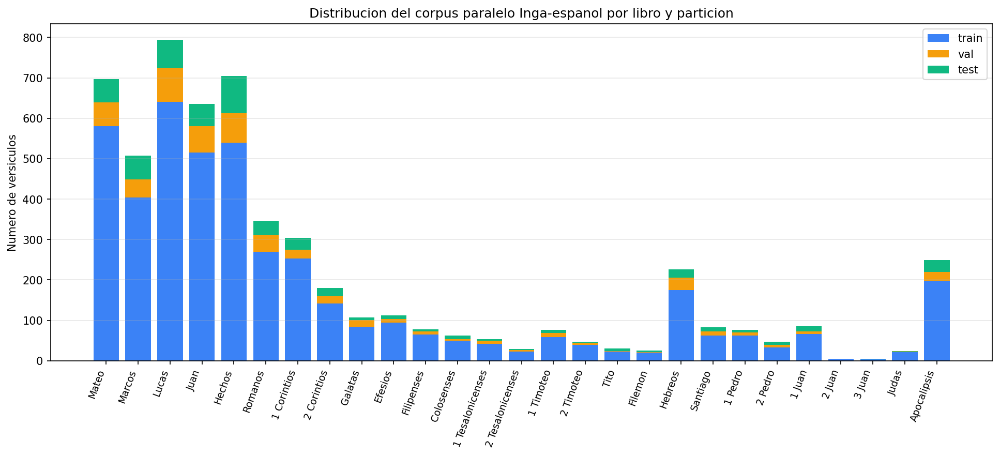
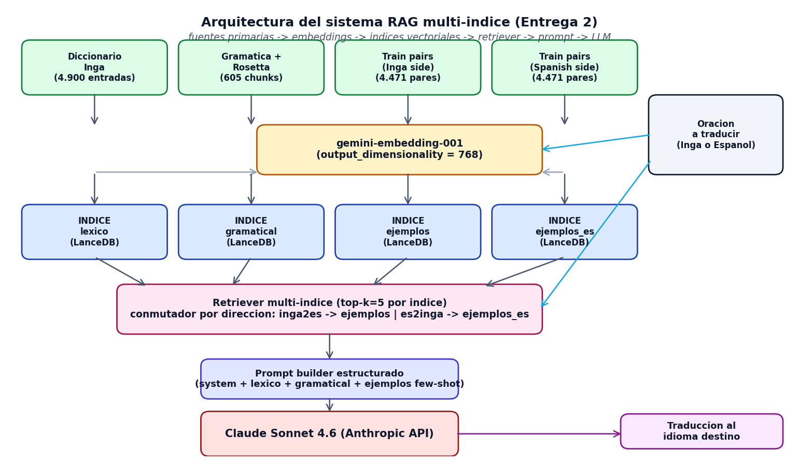
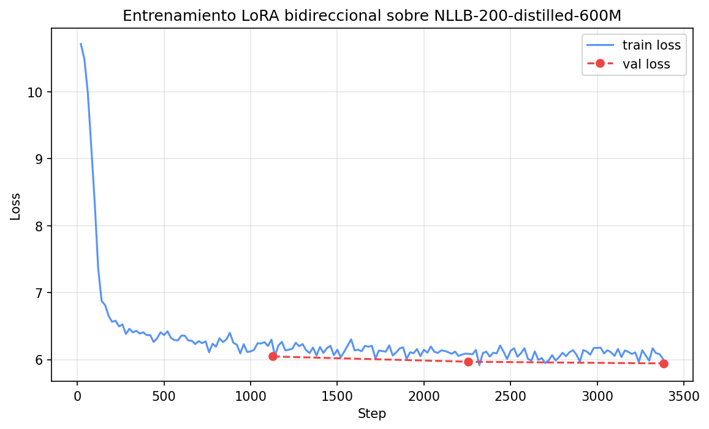
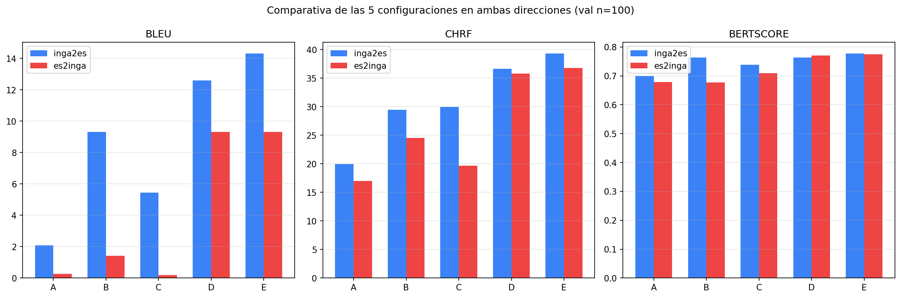

<!-- PORTADA -->

# Universidad Internacional de La Rioja
## Escuela Superior de Ingeniería y Tecnología
## Máster Universitario en Inteligencia Artificial

**Diseño e implementación de un sistema comparativo de traducción automática Inga-Español mediante ajuste fino de modelos multilingües y recuperación aumentada de información sobre modelos de lenguaje de frontera**

Trabajo fin de estudio presentado por:
- Eslava, Daniel
- Santos, William

**Tipo de trabajo:** Piloto experimental
**Director:** Víctor David Larco Torres
**Fecha:** 24 de mayo de 2026

---

## Resumen

La lengua Inga, una variante quechua del departamento del Putumayo en Colombia, no dispone de herramientas digitales de traducción. Cerca de 18.000 personas la hablan. Este trabajo aborda esa brecha con un sistema comparativo y bidireccional Inga-español construido sobre dos paradigmas complementarios. El primero adapta el modelo de traducción multilingüe NLLB-200-distilled-600M al par Inga-español mediante adaptadores de bajo rango (LoRA), aprovechando que las lenguas quechuas emparentadas ya están presentes en el preentrenamiento del modelo. El segundo opera sobre el modelo de lenguaje de frontera Claude Sonnet 4.6, enriquecido con recuperación aumentada desde una base de conocimiento estructurada en cuatro índices vectoriales: léxico, gramatical y dos índices de ejemplos paralelos que cubren las dos direcciones de traducción.

Esta memoria intermedia documenta el cierre de las primeras seis fases del proyecto y los resultados experimentales preliminares. El corpus paralelo alcanzó 5.589 pares verificados, generados mediante alineación canónica entre el Nuevo Testamento en Inga (Wycliffe) y la Reina-Valera 1909 en español, distribuidos en particiones de entrenamiento, validación y prueba. La base de conocimiento operativa cubre 4.900 entradas léxicas, 605 bloques gramaticales y 8.942 ejemplos paralelos indexados con embeddings de Gemini sobre LanceDB. La evaluación comparativa preliminar reportó las cinco configuraciones experimentales en ambas direcciones con métricas BLEU, chrF++ y BERTScore sobre el conjunto de validación.

La contribución original del trabajo es tripartita. Primero, una comparación sistemática entre adaptación NMT y recuperación aumentada sobre un mismo par lingüístico de recursos extremadamente bajos. Segundo, un sistema bidireccional que cubre Inga-español y español-Inga con un único adaptador y una arquitectura RAG simétrica. Tercero, la liberación abierta de todos los recursos derivados bajo licencias compatibles con la redistribución a la comunidad Inga, en línea con los principios éticos sistematizados por la literatura reciente sobre MT para lenguas indígenas.

**Palabras clave:** traducción automática, lenguas indígenas, Inga, transfer learning, recuperación aumentada de información

---

## Abstract

The Inga language, a Quechua variant from the Putumayo region of Colombia, has no available digital translation tools. It is spoken by approximately 18,000 people. This work addresses that gap with a comparative bidirectional Inga-Spanish translation system built on two complementary paradigms. The first adapts the NLLB-200-distilled-600M multilingual translation model to the Inga-Spanish pair using low-rank adapters (LoRA), leveraging the fact that related Quechua languages are already present in the model's pretraining. The second runs on top of the Claude Sonnet 4.6 frontier language model, enriched with retrieval-augmented generation from a knowledge base structured into four vector indices: lexical, grammatical, and two parallel-example indices that cover both translation directions.

This intermediate report documents the completion of the first six project phases and the preliminary experimental results. The parallel corpus reached 5,589 verified pairs, generated through canonical alignment between the Inga New Testament (Wycliffe) and the Spanish Reina-Valera 1909, distributed into training, validation, and test partitions. The operational knowledge base contains 4,900 lexical entries, 605 grammatical chunks, and 8,942 parallel examples indexed with Gemini embeddings on LanceDB. The preliminary comparative evaluation reported the five experimental configurations in both directions with BLEU, chrF++, and BERTScore metrics on the validation set.

The original contribution of this work is threefold. First, a systematic comparison between NMT adaptation and retrieval-augmented generation on the same extremely low-resource language pair. Second, a bidirectional system that covers both Inga-Spanish and Spanish-Inga with a single adapter and a symmetric RAG architecture. Third, the open release of all derived resources under licenses compatible with redistribution to the Inga community, in line with the ethical principles recently systematized in the literature on MT for indigenous languages.

**Keywords:** machine translation, indigenous languages, Inga (Quechua), transfer learning, retrieval-augmented generation

---

## Índice de contenidos

[Autogenerado en Word]

## Índice de figuras

[Autogenerado en Word]

## Índice de tablas

[Autogenerado en Word]

---

## Organización del trabajo en grupo

### Partes que aborda el TFE

El presente Trabajo Fin de Máster se desarrolla en modalidad grupal por dos estudiantes y aborda dos contribuciones técnicas autocontenidas que, de forma individual, podrían constituir un trabajo de investigación independiente, además de un componente de infraestructura compartida. Esta partición responde al requisito de la Universidad de que cada integrante realice un aporte técnico suficiente para la obtención del título, tal como se establece en la plantilla oficial para trabajos grupales.

La primera contribución, a cargo de **William Santos**, consiste en la adaptación de un modelo de traducción automática multilingüe preentrenado al par lingüístico Inga-Español mediante técnicas de ajuste fino eficiente en parámetros, aprovechando el conocimiento de lenguas quechuas emparentadas que el modelo ya incorpora como base para la transferencia cross-lingual. Este componente incluye además la curación del corpus bidialectal , Alto Putumayo y Medio Putumayo, labor que se nutre del acceso comunitario del integrante a hablantes nativos en Mocoa, así como la validación lingüística de las salidas del sistema.

La segunda contribución, a cargo de **Daniel Eslava**, consiste en el diseño e implementación de un sistema de traducción basado en un modelo de lenguaje de frontera potenciado con recuperación aumentada de información. El sistema utiliza una base de conocimiento lingüístico del Inga estructurada en tres índices independientes , léxico, gramatical y de ejemplos paralelos, que se consultan dinámicamente durante la inferencia. Este componente incluye adicionalmente el diseño del marco de evaluación comparativa entre ambas aproximaciones, así como la orquestación del pipeline completo de inferencia.

La infraestructura compartida entre ambos integrantes comprende la construcción y curación del corpus paralelo, la normalización ortográfica, la validación con hablantes nativos y el análisis de resultados en la fase de evaluación final.

### Distribución y estructura de la memoria

La estructura de responsabilidades para la redacción de la memoria se detalla en la Tabla 1.

**Tabla 1**
*Organización del trabajo en grupo en la redacción de la memoria*

| Apartado de la memoria | Responsables |
|---|---|
| Introducción | William Santos y Daniel Eslava |
| Contexto y estado del arte | William Santos (secciones sobre NMT y ajuste fino eficiente), Daniel Eslava (secciones sobre LLMs y RAG) |
| Objetivos y metodología de trabajo | William Santos y Daniel Eslava |
| Marco normativo | William Santos (aspectos comunitarios), Daniel Eslava (licenciamiento de datos y modelos) |
| Desarrollo, Adaptación del modelo multilingüe | William Santos |
| Desarrollo, Pipeline LLM con recuperación aumentada | Daniel Eslava |
| Desarrollo, Corpus e infraestructura experimental | William Santos y Daniel Eslava |
| Conclusiones | William Santos y Daniel Eslava |

*Nota.* Elaboración propia.

### Mecanismos de coordinación empleados

El trabajo remoto entre los dos integrantes, ubicados en Mocoa (Putumayo) y Cali (Valle del Cauca), exige mecanismos de coordinación formales que aseguren la trazabilidad de las decisiones técnicas y la consistencia de los entregables. Para ello se adoptan los siguientes instrumentos.

En primer lugar, se establece un repositorio compartido en la plataforma GitHub para el código fuente, los *notebooks* de experimentación y la documentación del proyecto, con control de versiones distribuido y revisión cruzada de las contribuciones mediante *pull requests* antes de su integración a la rama principal. En segundo lugar, se utiliza GitHub Projects para la gestión de tareas operativas, con tableros que reflejan las siete fases del proyecto descritas en el Capítulo 3. En tercer lugar, se planifican reuniones síncronas semanales por videoconferencia para revisión de avances, toma de decisiones arquitecturales y resolución de bloqueos; cada reunión produce un acta breve que se archiva en el repositorio. En cuarto lugar, se emplea un gestor bibliográfico compartido (Zotero) que mantiene sincronizadas las referencias verificadas del proyecto, con identificadores estables (DOI, arXiv, ACL Anthology) asociados a cada entrada. Finalmente, la memoria se redacta de forma colaborativa con asignación clara de secciones según la distribución mostrada en la Tabla 1 y revisión cruzada completa antes de cada entrega formal.

---

# 1. Introducción

## 1.1 Motivación

La lengua Inga, perteneciente a la familia lingüística quechua, constituye un sistema cultural vivo sostenido por aproximadamente 18.000 hablantes del pueblo Inga asentado en el departamento del Putumayo, al suroccidente de Colombia. Sus comunidades se distribuyen principalmente entre dos zonas dialectales: el Alto Putumayo, que abarca el Valle de Sibundoy con los corregimientos de San Andrés y los municipios de Santiago y Colón; y el Medio Putumayo, que comprende Mocoa, Condagua, Yunguillo y Puerto Guayuyaco. A pesar de seguir siendo una lengua de uso cotidiano en el hogar y en la vida comunitaria, el Inga atraviesa un proceso sostenido de desplazamiento frente al español, que opera como lengua dominante en los ámbitos educativo, institucional y digital. Este fenómeno no amenaza únicamente a un sistema de comunicación, sino a toda una cosmovisión y un sistema de conocimiento ancestral transmitido oralmente. La UNESCO (2022), en el *World Atlas of Languages*, advierte que las lenguas indígenas del mundo enfrentan un riesgo de desaparición sin precedentes, y por ello la Organización de las Naciones Unidas ha proclamado la Década Internacional de las Lenguas Indígenas 2022-2032.

Frente a esta realidad, la brecha digital adopta hoy la forma de una exclusión tecnológica. Los grandes traductores comerciales , como Google Translate y DeepL, no contemplan la lengua Inga en su catálogo. En mayo de 2022, Google Translate incorporó Quechua sureño a su conjunto de idiomas soportados, pero la variante Inga del Putumayo continúa excluida. Los escasos recursos digitales disponibles se limitan al *Diccionario Inga* del Valle de Sibundoy (Tandioy Jansasoy et al., 1997), a materiales pedagógicos del Instituto Lingüístico de Verano y a los recursos del programa *Inga Rimangapa Samuichi* de Indiana University, todos ellos con difusión restringida y sin integración computacional. La literatura reciente sobre procesamiento del lenguaje natural en lenguas indígenas de América Latina documenta con claridad este rezago sistemático (Tonja et al., 2024); los primeros esfuerzos de traducción automática para lenguas indígenas colombianas, incluida el Inga, aparecen con Prieto et al. (2024), quienes construyen el primer corpus paralelo documentado. Esta ausencia tecnológica profundiza la brecha entre las lenguas hegemónicas y las lenguas indígenas, y niega al Inga un espacio en el ecosistema digital contemporáneo.

Existe, sin embargo, un marco normativo y una ventana de oportunidad tecnológica que habilitan una respuesta viable desde la inteligencia artificial. La Constitución Política de Colombia (Asamblea Nacional Constituyente de Colombia, 1991) reconoce en su Artículo 10 la oficialidad territorial de las lenguas y dialectos de los grupos étnicos del país, y la Ley 1381 de 2010 desarrolla los derechos lingüísticos de estas comunidades, estableciendo principios explícitos de reconocimiento, fomento, protección, uso, preservación y fortalecimiento (Congreso de la República de Colombia, 2010). Los avances recientes en traducción automática multilingüe masiva, en técnicas de transfer learning desde lenguas emparentadas y en modelos de lenguaje de frontera potenciados con recuperación aumentada de información abren la posibilidad de producir herramientas utilizables para lenguas que hasta hace pocos años eran consideradas intratables. Las consideraciones éticas y comunitarias de este tipo de iniciativas se han sistematizado en la literatura reciente (Mager et al., 2023), y existen antecedentes exitosos de trabajos análogos, como la hoja de ruta desarrollada para el cherokee (Zhang et al., 2022). El presente trabajo se propone contribuir a cerrar la brecha digital del Inga situándose en la intersección de este marco normativo y esta oportunidad técnica.

## 1.2 Planteamiento del trabajo

El problema técnico que aborda el presente trabajo es la construcción de un sistema de traducción automática Inga-Español utilizable para una lengua que, antes de este proyecto, dispone de menos de 5.000 pares paralelos publicados en la literatura académica y de ningún sistema de traducción comercial o académico funcional. Este contexto define una situación de recursos extremadamente bajos que exige estrategias específicas distintas de las aplicadas a pares lingüísticos con abundancia de datos.

La pregunta de investigación que orienta el trabajo se formula en los siguientes términos: *¿cuál aproximación , el ajuste fino de un modelo de traducción automática multilingüe preentrenado mediante técnicas eficientes en parámetros, o el uso de un modelo de lenguaje de frontera potenciado con recuperación aumentada de información, resulta más efectiva para traducir del Inga al Español y viceversa cuando los datos paralelos disponibles son extremadamente escasos?* Esta formulación tiene dos implicaciones metodológicas. La primera es que no se presume *a priori* la superioridad de una aproximación sobre la otra: ambas representan paradigmas contemporáneos con evidencia favorable en distintos escenarios, y el trabajo contribuye evidencia comparativa directa. La segunda es que se apuesta por mantener la formulación neutra respecto a modelos o versiones específicas, de modo que la pregunta sobreviva a la evolución tecnológica del campo durante el desarrollo del proyecto.

La propuesta general de solución consiste en el desarrollo en paralelo de ambas aproximaciones sobre un corpus bidialectal construido a partir de recursos comunitarios, textos paralelos existentes y corpus de lenguas quechuas emparentadas. La comparación se realiza mediante métricas automáticas estándar (BLEU, chrF++, BERTScore) y mediante validación cualitativa con hablantes nativos del Inga. Los detalles arquitecturales y metodológicos se presentan en el Capítulo 3.

El alcance del TFM se limita a un piloto experimental local, ejecutable sobre hardware personal, y no a un sistema de producción. Se da cobertura explícita a los dos dialectos principales de la lengua , Alto Putumayo y Medio Putumayo, mediante fuentes documentales específicas de cada zona. Se establece como meta mínima la construcción de un corpus de 5.000 pares de oraciones paralelas, con una meta deseable de 10.000 pares al cierre del proyecto. La liberación de los recursos como bienes comunes para la comunidad Inga queda planteada como resultado natural del trabajo y como línea de trabajo ulterior, sin constituir un objetivo central de evaluación.

## 1.3 Estructura del trabajo

El documento se organiza en cinco capítulos, más las secciones de referencias bibliográficas y los anexos técnicos. El Capítulo 1 introduce la motivación del proyecto, el planteamiento del problema y la estructura general del trabajo. El Capítulo 2 desarrolla el contexto del problema, incluyendo la situación sociolingüística del Inga, el marco legal colombiano e internacional aplicable y los fundamentos técnicos de la traducción automática de bajos recursos, y presenta una revisión crítica del estado del arte en traducción automática de lenguas indígenas, con énfasis en los trabajos recientes sobre Quechua, que constituye el antecedente más cercano al Inga por pertenecer a la misma familia lingüística. En el Capítulo 3 se expone el objetivo general, los objetivos específicos y la metodología del trabajo, organizada en siete fases y acompañada del cronograma del proyecto y la descripción de la infraestructura computacional empleada. El Capítulo 4 presenta el desarrollo específico de la contribución; allí se documentan la configuración del entorno experimental, la construcción del corpus paralelo Inga-español a partir del Nuevo Testamento, el diseño e implementación de la base de conocimiento vectorial para la aproximación basada en recuperación aumentada, el ajuste fino bidireccional del modelo multilingüe NLLB-200 mediante adaptadores LoRA, el pipeline de traducción basado en el modelo de lenguaje de frontera Claude con recuperación aumentada, y la evaluación comparativa preliminar de las cinco configuraciones experimentales sobre el conjunto de validación. El Capítulo 5 recoge las conclusiones preliminares y las líneas de trabajo restantes hacia la entrega final del TFM. Cierran la memoria las referencias bibliográficas, siguiendo la norma APA séptima edición, y un anexo con el enlace al repositorio público de código y datos.

---

# 2. Contexto y estado del arte

## 2.1 Contexto del problema

### 2.1.1 La lengua Inga y su situación en el Putumayo

La lengua Inga es una variante norteña de la familia quechua, específicamente del grupo Quechua II-B según la clasificación de Torero, que se habla en el suroccidente de Colombia. Comparte con las demás lenguas quechuas una serie de rasgos tipológicos definitorios: es una lengua aglutinante , forma sus palabras mediante la concatenación de sufijos a una raíz, presenta orden sintáctico predominante sujeto-objeto-verbo (SOV), posee un sistema vocálico de tres unidades (/i/, /a/, /u/) y marca los casos gramaticales mediante sufijos nominales (Tandioy Jansasoy et al., 1997). El diccionario de referencia del Inga documenta estos rasgos sistemáticamente y registra la presencia de préstamos léxicos del español (marcados como *Esp*), americanismos (*Amer*) y vocablos provenientes de la lengua vecina Kamsá (*Kamtsa*), con la que el Inga ha mantenido contacto intenso en el Valle de Sibundoy.

El pueblo Inga está asentado principalmente en el departamento del Putumayo, en comunidades distribuidas entre dos zonas geográficas y dialectales claramente diferenciadas: el Alto Putumayo , que comprende el Valle de Sibundoy con los asentamientos de San Andrés, Santiago y Colón, y el Medio Putumayo , que incluye Mocoa, Condagua, Yunguillo, Puerto Guayuyaco y la Bota Caucana, con presencia también en el departamento de Nariño (Aponte) y en el Caquetá. El número de hablantes estimado asciende a aproximadamente 18.000 personas, cifra significativa en el contexto colombiano pero extremadamente reducida en comparación con las lenguas mayoritarias del país.

La existencia de dos variantes dialectales claramente documentadas , el Alto Putumayo (AP) y el Medio Putumayo (MP), con subvariantes como Yunguillo (Yun) y Guayuyaco (Gua), tiene implicaciones directas para cualquier sistema de traducción automática que se adopte. El propio *Diccionario Inga* (Tandioy Jansasoy et al., 1997) registra las diferencias léxicas entre dialectos; a modo de ilustración, el verbo "estornudar" aparece como *achijai* en el Alto Putumayo, *achijii* en Yunguillo y *jachii* en Mocoa. Estas variaciones, que afectan tanto al léxico como a la fonología y la morfología, implican que un corpus paralelo construido exclusivamente desde una variante dialectal no representa adecuadamente al conjunto de hablantes. El presente trabajo aborda esta heterogeneidad incorporando fuentes primarias de ambos dialectos.

La situación sociolingüística del Inga se caracteriza por un desplazamiento progresivo frente al español en los ámbitos institucional, educativo y económico, a pesar de mantener vitalidad en el hogar y la vida comunitaria. El panorama del procesamiento del lenguaje natural para lenguas indígenas de América Latina, sistematizado recientemente por Tonja et al. (2024), documenta que lenguas en esta categoría enfrentan un rezago tecnológico marcado que retroalimenta el desplazamiento sociolingüístico: sin presencia digital se pierde utilidad instrumental, y sin utilidad instrumental se acelera el desplazamiento. La UNESCO (2022), en su *World Atlas of Languages*, describe precisamente este círculo como uno de los principales factores de pérdida acelerada de lenguas en el mundo contemporáneo.

### 2.1.2 Marco legal-político en Colombia y contexto internacional

En el ámbito nacional, Colombia dispone de un marco normativo robusto para la protección y promoción de las lenguas indígenas. La Constitución Política de Colombia (Asamblea Nacional Constituyente de Colombia, 1991) establece en su Artículo 10 que "el castellano es el idioma oficial de Colombia. Las lenguas y dialectos de los grupos étnicos son también oficiales en sus territorios". Este principio de oficialidad territorial reconoce al Inga como lengua oficial en las comunidades donde se habla, con las implicaciones jurídicas que ello conlleva en materia de educación, acceso a la justicia y relación con la administración pública.

El desarrollo normativo específico de este reconocimiento constitucional se materializa en la Ley 1381 de 2010 (Congreso de la República de Colombia, 2010), por la cual se desarrollan los artículos 7°, 8°, 10 y 70 de la Constitución Política y se establecen normas sobre el reconocimiento, fomento, protección, uso, preservación y fortalecimiento de las lenguas de los grupos étnicos de Colombia y los derechos lingüísticos de sus hablantes. Esta ley consagra principios como la obligatoriedad estatal de proteger las lenguas nativas, el derecho a la educación intercultural bilingüe, la producción de materiales en lenguas nativas y el acceso a servicios públicos en la lengua propia. Sin embargo, la implementación efectiva de estos principios enfrenta limitaciones operativas importantes, entre ellas la ausencia casi total de herramientas digitales para las lenguas indígenas colombianas.

En el ámbito internacional, la Organización de las Naciones Unidas ha proclamado la Década Internacional de las Lenguas Indígenas 2022-2032, iniciativa cuyo seguimiento técnico se canaliza a través del *World Atlas of Languages* de la UNESCO (2022), un atlas interactivo que reemplaza al antiguo *Atlas of Languages in Danger* y que documenta actualmente 8.324 lenguas en el mundo, de las cuales un porcentaje significativo se encuentra en algún grado de vulnerabilidad o peligro de desaparición. Este marco internacional ofrece un respaldo político y simbólico fundamental, aunque los esfuerzos técnicos concretos , como el presente TFM, dependen principalmente de iniciativas académicas y comunitarias específicas.

La tensión entre un marco normativo amplio y una disponibilidad real de herramientas digitales es precisamente el espacio en el que se inscribe el presente trabajo. El proyecto se propone aportar evidencia técnica sobre la viabilidad de construir sistemas de traducción automática para lenguas indígenas colombianas utilizando las capacidades actuales de la inteligencia artificial, y contribuir de esta manera al cumplimiento práctico de los mandatos establecidos en la Constitución y la Ley 1381 de 2010.

### 2.1.3 Traducción automática de bajos recursos: fundamentos

La traducción automática (*Machine Translation* o MT) se define como la tarea computacional de convertir automáticamente un texto de una lengua fuente a una lengua destino preservando su contenido semántico y, en la medida de lo posible, sus propiedades estilísticas. En el contexto del procesamiento del lenguaje natural, las lenguas se categorizan habitualmente según la disponibilidad de recursos paralelos y monolingües: las lenguas de altos recursos , como el inglés, el español o el chino mandarín, cuentan con decenas de millones de pares paralelos publicados; las lenguas de recursos medios disponen de cifras en el orden de cientos de miles a millones de pares; y las lenguas de bajos recursos, entre las que se encuentran la mayoría de las lenguas indígenas del continente americano, disponen de menos de 100.000 pares y a menudo de cifras muy inferiores (Tonja et al., 2024). El Inga se ubica en una categoría aún más restrictiva, denominada en la literatura como "recursos extremadamente bajos" o *extremely low-resource*, caracterizada por disponer de menos de 5.000 pares paralelos antes de la ejecución del presente trabajo.

El paradigma dominante para la traducción automática ha evolucionado significativamente en las dos últimas décadas. Los sistemas de traducción automática estadística (SMT), que dominaron el campo hasta mediados de la década de 2010, fueron reemplazados por los sistemas de traducción automática neuronal (NMT) basados inicialmente en redes recurrentes con mecanismo de atención y, posteriormente, en la arquitectura *Transformer*. El salto cualitativo más reciente ha sido el desarrollo de modelos multilingües masivos entrenados sobre cientos de lenguas simultáneamente, con transferencia cross-lingual incorporada desde el preentrenamiento. El modelo NLLB-200 (No Language Left Behind), presentado por el equipo NLLB y Costa-jussà et al. (2022) y documentado posteriormente en *Nature* por el mismo equipo (NLLB Team et al., 2024), soporta traducción directa entre 200 lenguas, incluidas varias lenguas indígenas americanas como el Quechua Ayacucho (`quy_Latn`), el Guaraní y el Aymara. Esta propiedad habilita estrategias de transferencia desde lenguas quechuas ya incluidas en el modelo hacia el Inga, aún ausente en los datos de entrenamiento.

Los desafíos específicos de la traducción automática de bajos recursos son técnicos y evaluativos. Desde el punto de vista técnico, la escasez de datos paralelos impide el entrenamiento desde cero de modelos competitivos, y exige estrategias como transfer learning desde modelos preentrenados, augmentación sintética de datos (por ejemplo, *back-translation*), y ajuste fino eficiente en parámetros que no requiera entrenar millones de parámetros sobre corpus minúsculos. Desde el punto de vista evaluativo, las métricas automáticas tradicionales como BLEU fueron diseñadas originalmente para pares de alta disponibilidad de datos y tienden a penalizar en exceso las lenguas aglutinantes como el Inga, donde un mismo contenido semántico admite múltiples realizaciones superficiales válidas. Por ello, la literatura reciente (AmericasNLP 2024 y 2025; Ebrahimi et al., 2024; de Gibert et al., 2025) recomienda métricas basadas en caracteres como chrF++ (Popović, 2017) y métricas basadas en embeddings contextuales como BERTScore (Zhang et al., 2020) o COMET (Rei et al., 2022) como complemento indispensable a BLEU.

### 2.1.4 Transfer learning y recuperación aumentada: definiciones

El transfer learning o aprendizaje por transferencia en traducción automática consiste en reutilizar representaciones lingüísticas aprendidas por un modelo sobre una lengua de alta disponibilidad de datos como punto de partida para adaptarse a una lengua de baja disponibilidad. La forma más directa de transfer learning en NMT es el ajuste fino (*fine-tuning*) completo, que reentrena todos los parámetros del modelo preentrenado sobre el corpus específico de la lengua objetivo; sin embargo, esta aproximación requiere capacidad de cómputo considerable y es vulnerable al olvido catastrófico de las capacidades cross-lingual adquiridas durante el preentrenamiento. Una alternativa que ha ganado tracción desde 2022 es el ajuste fino eficiente en parámetros (*parameter-efficient fine-tuning* o PEFT), que modifica únicamente un subconjunto reducido de parámetros del modelo. La técnica más difundida en esta línea es *Low-Rank Adaptation* (LoRA), propuesta por Hu et al. (2022), que inserta matrices de bajo rango en las capas de atención del *Transformer* y entrena únicamente esos parámetros adicionales, preservando congelados los pesos originales del modelo preentrenado. Variantes más recientes como QLoRA (Dettmers et al., 2023) y DoRA (Liu et al., 2024) amplían las capacidades de LoRA en escenarios de recursos computacionales limitados o de mayor demanda de calidad.

La recuperación aumentada o *Retrieval-Augmented Generation* (RAG) es un paradigma arquitectural introducido originalmente por Lewis et al. (2020) para tareas intensivas en conocimiento , como la respuesta a preguntas de dominio abierto, que combina un generador neuronal con un mecanismo de recuperación de información. Ante una entrada dada, el sistema recupera fragmentos relevantes de una base de conocimiento externa mediante búsqueda por similitud (generalmente, vectorial con embeddings densos), los inyecta en el contexto del modelo generativo y produce la salida condicionada tanto a la entrada original como al material recuperado. La principal ventaja de RAG reside en que permite inyectar conocimiento específico del dominio sin necesidad de reentrenar el modelo, característica particularmente valiosa cuando los datos de entrenamiento son insuficientes para un ajuste fino tradicional.

La aplicación de RAG específicamente al problema de la traducción automática es relativamente reciente. Wang et al. (2024) proponen RAGtrans como el primer *benchmark* explícitamente dirigido a evaluar sistemas de traducción con recuperación aumentada sobre conocimiento no estructurado. En el contexto de lenguas de bajos recursos, Chen et al. (2024) demostraron con el sistema QueEn que la combinación de RAG con un modelo ajustado mediante LoRA permite alcanzar mejoras sustanciales en la traducción Quechua-Inglés, con incrementos documentados de entre 1.5 y 17.6 puntos BLEU según la configuración experimental. El presente TFM se inscribe en esta línea emergente de investigación, proponiendo una arquitectura RAG multi-índice específicamente diseñada para inyectar conocimiento lingüístico estructurado , léxico, gramatical y de ejemplos paralelos, en modelos de lenguaje de frontera operando sobre el par Inga-Español.

## 2.2 Estado del arte

### 2.2.1 Procesamiento del lenguaje natural para lenguas indígenas de América Latina

El panorama general del procesamiento del lenguaje natural aplicado a lenguas indígenas de América Latina fue recientemente sistematizado por Tonja et al. (2024), quienes analizaron los avances y retos en más de treinta lenguas pertenecientes a familias como la quechua, la tupí-guaraní, la náhuatl-uto-azteca, la maya y la aymara. El estudio identificó tres patrones recurrentes: la severa escasez de corpus paralelos publicados, la ausencia de estandarización ortográfica que dificulta el procesamiento automático, y la concentración de la mayoría del esfuerzo investigador en un subconjunto reducido de lenguas (principalmente Quechua, Guaraní y Nahuatl), con cobertura residual para el resto.

El principal foro canalizador de la investigación específica en traducción automática para lenguas indígenas de América es el taller *Workshop on NLP for Indigenous Languages of the Americas* (AmericasNLP), organizado desde 2021 como evento satélite de NAACL. La cuarta edición del taller, celebrada en 2024, organizó una tarea compartida centrada en traducción español a lenguas indígenas cubriendo once pares lingüísticos, cuyos resultados y análisis fueron publicados por Ebrahimi et al. (2024). La quinta edición, correspondiente a 2025, amplió el alcance a la creación de material educativo y al desarrollo de métricas específicas para lenguas indígenas (de Gibert et al., 2025), consolidando un conjunto estandarizado de corpus, líneas base y protocolos de evaluación que constituyen el estado del arte actual en el campo.

Un aspecto transversal a estos trabajos es la discusión sobre las implicaciones éticas y comunitarias del uso de tecnologías de traducción automática aplicadas a lenguas indígenas. Mager et al. (2023) sistematizaron en el marco de ACL las consideraciones éticas específicas de esta línea de investigación, enfatizando la importancia de la participación comunitaria, el consentimiento informado y el retorno de los beneficios a las comunidades hablantes. El presente TFM asume estos principios como parte integral de su diseño, tal como se detalla en el marco normativo y en la sección de organización del trabajo.

### 2.2.2 Traducción automática de lenguas indígenas colombianas

El estado del arte específico para lenguas indígenas colombianas es particularmente escaso. La primera contribución académica documentada que incluye explícitamente al Inga entre sus lenguas objetivo corresponde a Prieto et al. (2024) del equipo investigador de la Universidad de los Andes. En dicho trabajo, presentado en el taller AmericasNLP 2024, los autores construyeron el primer corpus paralelo multilingüe para lenguas indígenas colombianas a partir de fuentes como la Biblia, la Constitución Política y materiales pedagógicos, y aplicaron transfer learning desde el modelo NLLB-200 a cuatro pares: Español-Wayuunaiki, Español-Arhuaco, Español-Inga y Español-Kamsá. Los resultados reportados mostraron la viabilidad técnica del enfoque, aunque con valores BLEU modestos consistentes con la severa escasez de datos (BLEU entre 2 y 10 puntos según el par).

El trabajo de Prieto et al. (2024) fue extendido posteriormente por un equipo relacionado: Salazar, Manrique y Pereira Nunes (2025) publicaron en la revista *SN Computer Science* un análisis más amplio de estrategias de traducción automática para las mismas lenguas, incorporando técnicas adicionales como el ajuste fino eficiente en parámetros y la augmentación sintética de datos. Ambos trabajos constituyen los antecedentes académicos directos del presente TFM y definen la línea base contra la cual se compararán los resultados finales del proyecto.

Un aporte metodológico del presente trabajo respecto a estos antecedentes consiste en la cobertura explícita de las dos variantes dialectales principales del Inga , Alto Putumayo y Medio Putumayo, distinción que ninguno de los trabajos previos aborda explícitamente. Esta cobertura se sustenta en la incorporación de fuentes primarias específicas de cada dialecto: el *Diccionario Inga* (Tandioy Jansasoy et al., 1997) con sus marcadores dialectales, la *Gramática Pedagógica del Inga* de Levinsohn y Mongui centrada principalmente en el Alto Putumayo, y la cartilla *Antihua Pacay Gentecunapa Parlocuna* (Jamioy Yanangona de Peña, 1985) que documenta narrativas del Medio Putumayo. El detalle de estos recursos y de su procesamiento se presenta en el Capítulo 4.

### 2.2.3 Traducción automática para Quechua: el caso cercano al Inga

Dado que el Inga pertenece a la familia lingüística quechua, los avances recientes en traducción automática para variantes del Quechua constituyen el antecedente técnico más directamente transferible al presente proyecto. Esta sección sintetiza los trabajos más relevantes publicados entre 2024 y 2026.

Chen et al. (2024) presentaron **QueEn**, un sistema de traducción Quechua-Inglés que combina recuperación aumentada con ajuste fino mediante LoRA sobre un modelo de lenguaje grande. Los autores reportaron mejoras en BLEU de entre 1.5 y 17.6 puntos respecto a líneas base estándar, según la configuración experimental. Este trabajo constituye el antecedente metodológico más próximo al presente TFM, dado que combina las dos técnicas centrales , LoRA y RAG, sobre una lengua quechua. La principal diferencia metodológica es que QueEn utiliza una base de conocimiento unificada, mientras que el presente TFM propone una base multi-índice con separación explícita entre el conocimiento léxico, gramatical y de ejemplos paralelos.

Garcia Gilabert et al. (2024), del Barcelona Supercomputing Center (BSC), presentaron en AmericasNLP 2024 la submissión ganadora para los pares Español-Quechua y Español-Guaraní. Su propuesta consistió en el ajuste fino de NLLB-200 mediante adaptadores LoRA, entrenando únicamente el 14.2% de los parámetros del modelo original. Este resultado constituye evidencia empírica directa de la viabilidad del enfoque adoptado en el presente TFM: demuestra que la arquitectura NLLB+LoRA es competitiva en el estado del arte para una lengua quechua con cantidades de datos similares a las disponibles para el Inga, y que es factible ejecutarla con recursos computacionales moderados.

Attieh et al. (2024) presentaron, también en AmericasNLP 2024, la submissión NordicsAlps, que obtuvo el mejor chrF++ promedio en múltiples pares lingüísticos. Su contribución principal fue metodológica: demostraron el impacto positivo de la tokenización a nivel de bytes (*byte-level*) para lenguas aglutinantes, propiedad compartida por todas las lenguas quechuas incluido el Inga. Este hallazgo orienta las decisiones de preprocesamiento del presente proyecto.

DeGenaro y Lupicki (2024) exploraron en la misma edición del taller el contraste entre arquitecturas *Transformer* tradicionales y arquitecturas de estado-espacio como Mamba para traducción de lenguas indígenas. Aunque los resultados no superaron al ajuste fino convencional sobre NLLB-200, el estudio aporta información valiosa sobre la viabilidad de arquitecturas alternativas.

Más recientemente, Dhawan et al. (2026) publicaron una investigación sobre mejoras en la traducción automática de lenguas indígenas mediante datos sintéticos y preprocesamiento específico por lengua, con experimentos sobre Guaraní, Quechua y Aymara. Sus hallazgos sobre normalización ortográfica y filtrado de ruido son particularmente aplicables al corpus Inga, que presenta heterogeneidades ortográficas por provenir de fuentes editadas en distintas épocas y bajo distintos acuerdos de alfabeto.

En conjunto, estos trabajos demuestran que el par tecnológico central del presente TFM , ajuste fino eficiente sobre NLLB-200 más estrategias complementarias de recuperación aumentada, es una aproximación viable y alineada con el estado del arte para lenguas de la familia quechua.

### 2.2.4 Modelos de lenguaje de frontera para traducción

La emergencia de modelos de lenguaje de frontera (*frontier LLMs*) con capacidades multilingües ha transformado el panorama de la traducción automática desde 2023. A diferencia de los sistemas de traducción neuronal especializados , como NLLB-200, los LLMs abordan la traducción como un caso particular de generación condicionada mediante *prompting* en lenguaje natural, lo que habilita aproximaciones *zero-shot*, *few-shot* y con recuperación aumentada. La literatura reciente ha documentado tanto las fortalezas como las limitaciones de este paradigma para lenguas de bajos recursos.

Hendy et al. (2023) realizaron una de las evaluaciones más comprehensivas iniciales sobre el desempeño de los modelos GPT en traducción automática, comparándolos con sistemas NMT dedicados a través de 18 pares lingüísticos. Sus resultados documentaron una brecha consistente en favor de los sistemas especializados en los escenarios de bajos recursos, aunque también señalaron que esta brecha se estrechaba significativamente conforme avanzaban las versiones de los LLMs. Este patrón ha sido confirmado y extendido por trabajos posteriores: Zhu et al. (2024) publicaron en *Findings of NAACL 2024* un análisis empírico sistemático de la traducción multilingüe con LLMs en el que confirman que la brecha persiste para lenguas extremadamente poco cubiertas en los datos de preentrenamiento, pero se reduce notablemente en presencia de pocos ejemplos en el *prompt*.

Una contribución particularmente relevante para el diseño del presente TFM es el trabajo de Enis y Hopkins (2024), que examinó específicamente las capacidades del modelo Claude de Anthropic en traducción de bajos recursos. Los autores documentaron que, entre los LLMs evaluados, Claude exhibió una "eficiencia de recursos" (*resource efficiency*) diferencial: su calidad de traducción degrada menos que la de otros modelos comparables al pasar de lenguas de altos recursos a lenguas de bajos recursos. Este hallazgo motiva la elección de un modelo de lenguaje de frontera con propiedades similares como línea experimental complementaria al ajuste fino de NLLB en el presente trabajo.

La literatura más reciente sobre *in-context learning* (ICL) en lenguas de bajos recursos ha sido sistematizada por Cahyawijaya, Lovenia y Fung (2024), quienes demostraron en NAACL 2024 que los LLMs operan efectivamente como aprendices *few-shot* cuando se les proporcionan ejemplos cuidadosamente seleccionados, y que la selección por similitud semántica supera consistentemente a la selección aleatoria. Este resultado proporciona el fundamento teórico para el diseño del índice de ejemplos del sistema RAG propuesto en el Capítulo 3, que recupera oraciones paralelas Inga-Español similares a la entrada para inyectarlas como ejemplos *few-shot* al modelo de lenguaje.

### 2.2.5 Recuperación aumentada aplicada a traducción

La aplicación sistemática del paradigma de recuperación aumentada a la tarea específica de traducción automática es una línea de investigación emergente, con literatura concentrada principalmente en el bienio 2024-2025. El trabajo fundacional del paradigma RAG (Lewis et al., 2020) se propuso originalmente para tareas de dominio abierto intensivas en conocimiento factual, y su adaptación a traducción requiere diseños arquitecturales específicos que distintos autores han explorado recientemente.

Wang et al. (2024) presentaron **RAGtrans**, el primer *benchmark* específicamente diseñado para evaluar sistemas de traducción automática con recuperación aumentada sobre conocimiento no estructurado. Los autores demostraron que la incorporación de conocimiento recuperado mejora consistentemente la calidad de traducción en pares multilingües, especialmente en dominios especializados donde el vocabulario técnico está mal representado en los datos de entrenamiento. Este trabajo establece la validez del paradigma RAG-MT como línea de investigación independiente y proporciona un marco evaluativo transferible al presente proyecto.

El trabajo de Chen et al. (2024) QueEn, ya mencionado en la sección 2.2.3, constituye la aplicación más directa de RAG a una lengua quechua: combina recuperación de contexto relevante con ajuste fino mediante LoRA, demostrando mejoras sustanciales sobre líneas base en Quechua-Inglés. La base de conocimiento utilizada en QueEn es principalmente un corpus de oraciones paralelas; el presente TFM extiende esta idea proponiendo una base multi-índice que separa explícitamente el conocimiento léxico (entradas del diccionario), el conocimiento gramatical (reglas morfosintácticas) y los ejemplos paralelos, lo que permite al sistema consultar cada tipo de conocimiento de manera específica según la naturaleza de la información que requiere para la traducción.

La literatura actualmente disponible sobre RAG-MT multi-índice es escasa; no se han identificado trabajos previos que estructuren la base de conocimiento lingüístico en índices independientes como se propone en el presente trabajo. Esta estructuración constituye, por tanto, una contribución metodológica original del proyecto.

### 2.2.6 Técnicas de ajuste fino eficiente en parámetros

El campo del ajuste fino eficiente en parámetros (*parameter-efficient fine-tuning* o PEFT) ha experimentado una expansión notable desde 2021. La técnica más influyente y ampliamente adoptada es *Low-Rank Adaptation* (LoRA), propuesta por Hu et al. (2022) y publicada en ICLR 2022. LoRA se fundamenta en la observación empírica de que los cambios en los pesos de un modelo durante el ajuste fino tienen un rango intrínseco bajo, y reemplaza la actualización de matrices densas por la suma de dos matrices de bajo rango que se entrenan conjuntamente. En la práctica, LoRA reduce el número de parámetros entrenables en tres o cuatro órdenes de magnitud respecto al ajuste fino completo, con pérdida mínima de calidad en la tarea final. Esta propiedad hace a LoRA particularmente adecuado para escenarios con restricciones de cómputo.

Dettmers et al. (2023) propusieron **QLoRA** como una extensión de LoRA que introduce cuantización a 4 bits del modelo base preentrenado, manteniendo los adaptadores LoRA en precisión completa. Esta combinación permite el ajuste fino de modelos significativamente mayores en hardware con memoria limitada sin comprometer la calidad final, ampliando el alcance práctico de la técnica. El trabajo fue publicado en NeurIPS 2023 y constituye la referencia estándar para escenarios con restricciones de memoria.

Liu et al. (2024) presentaron **DoRA** (*Weight-Decomposed Low-Rank Adaptation*) como una evolución de LoRA. La propuesta descompone cada matriz de pesos en una componente de magnitud y una componente de dirección, aplicando LoRA únicamente sobre la componente direccional. El trabajo, publicado como *oral* en ICML 2024, demuestra mejoras sistemáticas sobre LoRA a igual número de parámetros entrenables en varios *benchmarks* de lenguaje natural y visión, y es una alternativa natural a evaluar en etapas avanzadas del TFM.

Un estudio comparativo especialmente relevante para las decisiones metodológicas del presente trabajo es el de Su et al. (2024), que evaluó empíricamente ocho métodos PEFT sobre quince arquitecturas distintas en el escenario específico de traducción automática de bajos recursos (*low-resource language translation*, LRL-NMT). El estudio recomienda un conjunto de combinaciones modelo-método según el volumen de datos paralelos disponibles y las capacidades computacionales, y sirve como guía para el diseño experimental del presente proyecto.

### 2.2.7 Modelos base candidatos: análisis comparativo

La selección del modelo multilingüe preentrenado que servirá como base para el ajuste fino constituye una decisión arquitectural central del proyecto. Tres familias de modelos merecen consideración: NLLB-200 de Meta, MADLAD-400 de Google y TranslateGemma de Google DeepMind. A continuación se presenta una comparativa sintética de sus características técnicas en la Tabla 2.

**Tabla 2**
*Comparativa de modelos multilingües candidatos para la adaptación al par Inga-Español*

| Modelo | Parámetros | Número de lenguas | Quechua incluido | Licencia | Arquitectura | Ajustable en M4 Max 128 GB |
|---|---|---|---|---|---|---|
| NLLB-200-3.3B (NLLB Team, 2022, 2024) | 3.3 mil millones | 200 | Sí (`quy_Latn`) | CC BY-NC 4.0 | Encoder-decoder | Sí, permite incluso el fine-tuning completo |
| NLLB-200-distilled-600M | 600 millones | 200 | Sí | CC BY-NC 4.0 | Encoder-decoder | Sí, con amplio margen |
| MADLAD-400-10B (Kudugunta et al., 2023) | 10.7 mil millones | 450+ | Sí (`qu`) | Apache 2.0 | T5 | Sí, con ajuste fino eficiente (LoRA/QLoRA) |
| TranslateGemma-12B (Finkelstein et al., 2026) | 12 mil millones | Multilingüe | Parcial | Gemma License | Decoder-only | Sí, con ajuste fino eficiente |

*Nota.* Elaboración propia con base en la documentación técnica publicada por los autores respectivos.

La decisión metodológica del presente proyecto consiste en adoptar **NLLB-200-distilled-600M** como modelo principal para la fase de prototipado rápido , por su menor requerimiento de cómputo y tiempo de iteración, y **NLLB-200-3.3B** como modelo principal para los experimentos finales. La justificación es triple. Primero, NLLB-200 es el modelo dominante en las competiciones AmericasNLP de los últimos años, tal como evidencian los trabajos de Garcia Gilabert et al. (2024), Attieh et al. (2024) y DeGenaro y Lupicki (2024), lo que asegura compatibilidad metodológica con el estado del arte. Segundo, incluye explícitamente Quechua Ayacucho (`quy_Latn`) entre sus 200 lenguas soportadas, habilitando transferencia directa cross-lingual hacia el Inga. Tercero, la versión de 3.3 mil millones de parámetros resulta ajustable de manera completa o mediante LoRA en la estación local disponible para el proyecto (Apple M4 Max con 128 GB de RAM unificada), eliminando la dependencia de plataformas cloud. Los modelos MADLAD-400 y TranslateGemma se reservan como alternativas para experimentos ulteriores de validación cruzada.

## 2.3 Conclusiones del capítulo

La revisión del estado del arte presentada en este capítulo permite derivar cuatro conclusiones fundamentales que orientan el diseño metodológico del presente TFM.

Primero, la viabilidad técnica de adaptar modelos de traducción automática multilingüe preentrenados a lenguas indígenas de América Latina mediante transferencia desde parientes lingüísticos está sólidamente documentada. Los resultados del equipo BSC en AmericasNLP 2024 (Garcia Gilabert et al., 2024), así como los de Chen et al. (2024) con QueEn, muestran que el par tecnológico central del proyecto , NLLB-200 como modelo base, ajustado mediante LoRA con transferencia desde Quechua Ayacucho, es competitivo en el estado del arte para variantes del Quechua con cantidades de datos comparables a las disponibles para el Inga.

Segundo, el paradigma de modelos de lenguaje de frontera con recuperación aumentada ha emergido como una alternativa complementaria con propiedades favorables específicas para lenguas de bajos recursos. La "eficiencia de recursos" documentada para Claude por Enis y Hopkins (2024), junto con la evidencia sobre *in-context learning few-shot* de Cahyawijaya, Lovenia y Fung (2024), sustentan la segunda línea experimental del presente trabajo.

Tercero, existe un vacío específico en la literatura que el presente TFM contribuye a cerrar: no se ha identificado ningún trabajo previo que compare sistemáticamente ambas aproximaciones , ajuste fino eficiente de NMT multilingüe versus modelo de lenguaje de frontera con recuperación aumentada, sobre el mismo par lingüístico de bajos recursos, y tampoco trabajos que aborden el Inga con cobertura dialectal explícita de Alto Putumayo y Medio Putumayo. Ambas contribuciones constituyen el aporte original del proyecto.

Cuarto, la evaluación de sistemas de traducción automática para lenguas aglutinantes como el Inga requiere métricas que complementen al BLEU con alternativas sensibles a la morfología (chrF++, Popović, 2017) y a la semántica profunda (BERTScore, Zhang et al., 2020; COMET, Rei et al., 2022). La validación humana con hablantes nativos es además indispensable para capturar dimensiones de calidad no reflejadas por las métricas automáticas, tal como enfatizan Ebrahimi et al. (2024) y de Gibert et al. (2025) en los *findings* oficiales de AmericasNLP.

Estas conclusiones justifican la metodología que se expone en el siguiente capítulo, organizada en siete fases que abordan secuencialmente la configuración del entorno, la construcción del corpus bidialectal, el diseño de la base de conocimiento, las dos líneas experimentales centrales del proyecto, la evaluación comparativa rigurosa y el despliegue final.

---

# 3. Objetivos concretos y metodología de trabajo

## 3.1 Objetivo general

Desarrollar y evaluar un sistema de traducción automática Inga-Español que combine la adaptación de modelos de traducción automática multilingüe con aproximaciones basadas en recuperación aumentada de información sobre modelos de lenguaje de frontera, con el fin de contribuir a la preservación digital de la lengua Inga del Putumayo.

La formulación sigue el criterio SMART (Doran, 1981) que la plantilla de TFM asume como referencia. El objetivo es específico porque acota el par lingüístico (Inga-español) y el paradigma técnico (comparación de dos aproximaciones), y es medible mediante métricas automáticas estándar de traducción complementadas con validación cualitativa de hablantes nativos. La viabilidad está respaldada por evidencia reciente sobre la familia quechua, en particular los resultados de Garcia Gilabert et al. (2024) y Chen et al. (2024) que demuestran la efectividad de las técnicas elegidas en lenguas hermanas con cantidades de datos comparables. Su relevancia se sustenta en una doble dimensión: atender a una lengua sin herramientas digitales de traducción y contribuir al cumplimiento práctico del marco normativo colombiano de protección de lenguas indígenas (Congreso de la República de Colombia, 2010). El plazo es el ciclo de seis meses asignado al desarrollo del TFM.

La formulación del objetivo general se mantiene intencionalmente neutra respecto a modelos o versiones tecnológicas específicas. Las decisiones sobre modelos concretos , NLLB-200, Claude, FAISS, LlamaIndex, entre otros, se documentan en la metodología y en el capítulo de desarrollo, de modo que la evolución natural del estado del arte durante el periodo de ejecución del proyecto no invalide la formulación de los objetivos.

## 3.2 Objetivos específicos

Del objetivo general se derivan siete objetivos operativos que ordenan el trabajo según las dependencias técnicas naturales del proyecto, desde la preparación del entorno hasta el despliegue de los modelos. Cada uno tiene asociado un criterio de cumplimiento verificable.

La primera tarea es preparar el entorno de cómputo local en hardware Apple Silicon, con las bibliotecas de procesamiento del lenguaje natural, la aceleración por GPU integrada y la infraestructura mínima de seguimiento de experimentos. El criterio operativo asociado es ejecutar con éxito una inferencia zero-shot de un modelo multilingüe preentrenado, lo que valida que el stack funciona extremo a extremo antes de comprometer tiempo en datos o entrenamiento.

A continuación viene la construcción del corpus paralelo. Las fuentes disponibles son escasas y heterogéneas: el Nuevo Testamento Inga publicado por Wycliffe, las narrativas orales recopiladas en *Antihua Pacay*, el diccionario Tandioy, la gramática pedagógica de Levinsohn y un apéndice morfosintáctico del proyecto Rosetta. El reto está en extraer, alinear, normalizar y particionar todo esto en conjuntos de entrenamiento, validación y prueba aprovechables. La meta mínima cuantitativa son 5.000 pares paralelos; la cobertura debe alcanzar las dos variantes dialectales del Inga, Alto y Medio Putumayo, aunque el balance entre ambas dependerá de la calidad efectiva de las fuentes de cada lado.

En paralelo se construye la base de conocimiento lingüístico que alimentará la línea experimental del modelo de lenguaje de frontera. Esta base se estructura deliberadamente en índices separados, no en un único índice mezclado, para que el sistema de recuperación pueda dirigir cada consulta al tipo de conocimiento relevante: el índice léxico para palabras del diccionario, el índice gramatical para reglas morfosintácticas, el índice de ejemplos para pares Inga-español similares semánticamente. Se considera cumplido cuando la base es consultable y cubre al menos 800 entradas léxicas, las reglas gramaticales principales del Inga y una muestra representativa del corpus paralelo.

El cuarto objetivo es la adaptación de un modelo de traducción multilingüe preentrenado al par Inga-español. La técnica elegida es ajuste fino eficiente en parámetros, que evita reentrenar el modelo completo y aprovecha las representaciones de las lenguas quechuas emparentadas que el modelo ya conoce de su preentrenamiento. La adaptación se considera lograda cuando supera, en el conjunto de prueba, la línea base zero-shot del mismo modelo base sin ajuste.

La quinta línea de trabajo implementa el pipeline alternativo: un modelo de lenguaje de frontera consume *prompts* estructurados que se construyen dinámicamente recuperando contexto desde los tres índices de la base de conocimiento. El criterio de cumplimiento aquí es funcional más que cuantitativo: el pipeline debe integrar los tres índices, mantener tiempos de inferencia razonables en lote y producir traducciones consistentes en estructura.

Una vez ambas líneas están operativas, se ejecuta la evaluación comparativa con métricas automáticas estándar (BLEU, chrF++ y BERTScore) y validación cualitativa con hablantes nativos en las dimensiones de adecuación semántica, fluidez gramatical y naturalidad cultural. El informe final debe cubrir al menos cinco configuraciones experimentales con validación humana sobre una muestra representativa de traducciones.

El cierre del proyecto consiste en empaquetar el sistema resultante como una aplicación local reproducible y documentar el marco metodológico de manera que sea reutilizable por otras lenguas indígenas en situación análoga. El entregable concreto es un repositorio público con instrucciones de despliegue y un documento metodológico que explicite las decisiones tomadas en cada fase.

## 3.3 Metodología del trabajo

### 3.3.1 Enfoque metodológico

El presente TFM adopta un enfoque de investigación aplicada con diseño experimental comparativo. La estrategia central consiste en desarrollar dos sistemas de traducción en paralelo , uno basado en el ajuste fino eficiente de un modelo multilingüe preentrenado y otro basado en un modelo de lenguaje de frontera con recuperación aumentada de información, y evaluar rigurosamente cuál produce mejores traducciones para el par Inga-Español. La evaluación se realiza con métricas automáticas estandarizadas y con validación humana por hablantes nativos, asegurando la triangulación de las conclusiones.

### 3.3.2 Fases del proyecto

El trabajo se organiza en siete fases con una correspondencia uno a uno con los objetivos específicos enunciados en la sección 3.2. El detalle pedagógico y técnico de cada fase se resume a continuación; la ejecución concreta se documenta en el Capítulo 4.

La fase inicial es la configuración del entorno de cómputo: instalación de las bibliotecas de NLP (*Transformers*, *PEFT*, *Accelerate*, *sentence-transformers*, *sacrebleu*, *datasets*) sobre Apple Silicon y validación de la aceleración MPS por hardware. Se cierra con una inferencia zero-shot de prueba sobre un modelo multilingüe preentrenado, que sirve como prueba de extremo a extremo de que el stack funciona antes de comprometer tiempo en datos o entrenamiento.

Construir el corpus paralelo es la segunda fase y la más laboriosa de las preparatorias. Se aplica un pipeline de segmentación, detección de idioma por bloque, alineación canónica o heurística según la fuente, normalización ortográfica y partición en conjuntos de entrenamiento, validación y prueba. Las cinco fuentes primarias del Inga descritas en los capítulos 2 y 4 entran en este pipeline, cada una con peculiaridades de formato que obligan a parsers específicos. El proceso completo se ilustra en la Figura 4.

**Figura 4**
*Pipeline de construcción del corpus paralelo Inga-Español*

*Nota.* Elaboración propia.

Tras el corpus se diseña la base de conocimiento para la línea experimental basada en recuperación aumentada. Tres índices independientes: uno léxico derivado del diccionario, uno gramatical derivado de la gramática pedagógica y del apéndice morfosintáctico, y uno de ejemplos paralelos derivado del corpus alineado. La indexación combina embeddings multilingües densos y una base de datos vectorial local. Las estrategias de control de contexto (top-k acotado, umbrales de similitud, presupuestos de tokens, *reranking* opcional con *cross-encoder*) se ajustan para mantener el *prompt* del modelo generativo dentro de límites manejables.

La cuarta fase aborda el ajuste fino eficiente en parámetros del modelo base. Se aprovecha el código de lengua Quechua Ayacucho (`quy_Latn`) que el modelo ya contempla como punto de partida para la transferencia al Inga, lo cual reduce drásticamente la cantidad de datos paralelos necesarios respecto a entrenar desde cero. Cuando el calendario lo permite, se incluyen experimentos de *ablation* sobre dimensionalidad de los adaptadores, tasa de aprendizaje y augmentación sintética por *back-translation*. La Figura 5 muestra el pipeline.

**Figura 5**
*Pipeline de ajuste fino eficiente del modelo de traducción multilingüe*

*Nota.* Elaboración propia.

En paralelo con la cuarta fase corre la quinta, que implementa la línea LLM más RAG. Un modelo de lenguaje de frontera recibe un *prompt* construido en tiempo de inferencia con el contexto recuperado de los tres índices. El detalle del pipeline aparece en la Figura 6.

**Figura 6**
*Pipeline de traducción basado en modelo de lenguaje de frontera con recuperación aumentada*

*Nota.* Elaboración propia.

La sexta fase es la evaluación comparativa. Cada una de las configuraciones definidas en la Tabla 4 se mide con BLEU, chrF++ y BERTScore sobre el conjunto de validación, complementadas con sesiones de validación humana con hablantes nativos. Los resultados se sintetizan en el Capítulo 4; el análisis cualitativo profundo y la validación humana extendida se reservan para la entrega final del TFM.

Cierra el cronograma la séptima fase, dedicada a empaquetar el sistema como aplicación local replicable y a documentar el marco metodológico como aporte reutilizable.

### 3.3.3 Cronograma

El cronograma global del proyecto se muestra en la Figura 8. Las fases presentan traslape planificado cuando las dependencias lo permiten: en particular, la construcción del corpus (Fase 2) se inicia en paralelo con la configuración del entorno y se prolonga durante varios meses, alimentando tanto al ajuste fino (Fase 4) como al sistema RAG (Fases 3 y 5) a medida que avanza.

**Figura 8**
*Cronograma del proyecto, distribuido por fases y fechas*

*Nota.* Elaboración propia.

### 3.3.4 Infraestructura de cómputo

La infraestructura de cómputo empleada se detalla en la Tabla 5. La decisión de operar sobre hardware local de alta capacidad , en lugar de plataformas cloud, se fundamenta en tres consideraciones: reproducibilidad del entorno, soberanía de los datos lingüísticos de la comunidad Inga y predictibilidad del costo del proyecto. La API del modelo de lenguaje de frontera se utiliza únicamente para la línea experimental correspondiente.

**Tabla 5**
*Infraestructura de cómputo del proyecto*

| Recurso | Especificación | Uso principal |
|---|---|---|
| Estación de trabajo local | Apple M4 Max, 128 GB de RAM unificada | Inferencia y ajuste fino eficiente del modelo multilingüe; indexación y recuperación vectorial; ejecución de todos los *notebooks* del proyecto. |
| API de modelo de lenguaje de frontera | Anthropic (modelo vigente al cierre del TFM) | Pipeline de traducción con recuperación aumentada; línea experimental LLM. |
| Almacenamiento vectorial local | FAISS o ChromaDB (decisión técnica en Fase 3) | Indexación de la base de conocimiento lingüístico del Inga. |
| Control de versiones | Git y GitHub | Código fuente, notebooks, documentación del proyecto. |

*Nota.* Elaboración propia.

### 3.3.5 Configuraciones experimentales a evaluar

La Fase 6 evalúa al menos cinco configuraciones experimentales, cuyo diseño se resume en la Tabla 4. Las configuraciones permiten aislar el efecto de cada técnica central (ajuste fino, recuperación aumentada, su combinación) y comparar líneas de base zero-shot con las aproximaciones adaptadas específicamente al Inga.

**Tabla 4**
*Configuraciones experimentales a evaluar en la Fase 6 del proyecto*

| Config. | Modelo | Técnica | Recursos utilizados |
|---|---|---|---|
| A | Modelo multilingüe base (p. ej., NLLB-200-3.3B) | Traducción zero-shot con código de lengua más cercano (`quy_Latn`) | N/A |
| B | Modelo multilingüe base | Ajuste fino eficiente (LoRA) sobre corpus Inga bidialectal | Corpus paralelo AP + MP |
| C | Modelo de lenguaje de frontera | Prompt zero-shot | N/A |
| D | Modelo de lenguaje de frontera | Recuperación aumentada multi-índice (léxico, gramatical, ejemplos) | Base de conocimiento del Inga |
| E | Modelo multilingüe ajustado (config. B) | Recuperación aumentada aplicada en inferencia | Corpus + base de conocimiento |

*Nota.* Elaboración propia.

---

# 4. Desarrollo específico de la contribución

Este capítulo documenta la implementación de las Fases 1 a 6 del proyecto. Las dos primeras fases quedaron operativas en la iteración anterior; el resto se desarrolla en su totalidad en la presente memoria.

## 4.1 Configuración del entorno computacional

Sobre la estación local Apple M4 Max (128 GB de memoria unificada, macOS Darwin 25.3.0) se montó el entorno experimental con Python 3.11 gestionado mediante `uv`. El proyecto se reorganizó como paquete reproducible con `pyproject.toml`, lockfile (`uv.lock`) y archivo de variables de entorno separado (`.env.example`) para las credenciales de APIs externas. Las librerías centrales utilizadas son *transformers*, *peft* y *accelerate* para el ajuste fino de modelos multilingües; *sentence-transformers* y la SDK oficial *google-genai* para los embeddings densos; *anthropic* para el modelo de lenguaje de frontera; *lancedb* para el almacenamiento vectorial; y *sacrebleu* y *bert-score* para la evaluación automática. La aceleración por hardware Metal Performance Shaders (MPS) se validó en una inferencia zero-shot del modelo `facebook/nllb-200-distilled-600M` sobre el par Español-Quechua Ayacucho (`spa_Latn` a `quy_Latn`), que constituye el criterio de cierre formal de esta fase. El detalle del entorno se preserva en el Notebook 00 del repositorio, referenciado en el Anexo A.

## 4.2 Construcción del corpus paralelo

La construcción del corpus paralelo Inga-Español se apoya en cinco fuentes primarias previamente extraídas a formato Markdown mediante reconocimiento óptico de caracteres. El inventario consolidado se muestra en la Tabla 3.

**Tabla 3**
*Inventario de recursos lingüísticos primarios utilizados en la construcción del corpus*

| Recurso | Dialecto | Páginas | Registro | Tipo de alineación | Unidades detectadas |
|---|---|---|---|---|---|
| *Diccionario Inga* (Tandioy Jansasoy et al., 1997) | AP + MP (marcado) | 177 | Léxico | N/A | 4.900 entradas |
| *Gramática Pedagógica del Inga* (Levinsohn y Mongui) | AP principalmente | 228 | Didáctico | N/A | 560 bloques |
| Apéndice morfosintáctico (Rosetta Project) | N/A | 26 | Técnico | N/A | 45 bloques |
| *El Nuevo Testamento en Inga* (Wycliffe Bible Translators, 2012) | AP (probable) | 595 | Bíblico-literario | Versículo | 6.083 versículos |
| *Antihua Pacay Gentecunapa Parlocuna* (Jamioy Yanangona de Peña, 1985) | MP (Mocoa) | 68 | Narrativo oral | Bloque | 86 pares exploratorios |

*Nota.* Elaboración propia a partir de los notebooks 03 a 07 del presente trabajo. La cifra total de páginas OCR asciende a 1.094.

### 4.2.1 Reextracción estructurada del Nuevo Testamento en Inga

El OCR original del Nuevo Testamento Wycliffe presenta tres tipos de señal aprovechables para reconstruir la estructura libro-capítulo-versículo: cabeceras de página en mayúsculas con el nombre del libro y el número de capítulo (con notación `LIBRO X, Y` cuando la página cubre una transición de capítulo); marcadores de versículo en caracteres Unicode superíndice, concatenables como `¹²` o combinados con guion como `⁴-⁵` para versículos fusionados; y dígitos ASCII intercalados en el cuerpo del texto. El parser desarrollado en el Notebook 03 recorre el documento línea por línea manteniendo el estado actual de libro y capítulo, descarta encabezados de pericope (que el OCR marca con el mismo nivel de heading que las divisiones de libro) y aplica un resolutor contextual para los casos ambiguos: el heading `# SAN JUAN`, por ejemplo, puede corresponder al evangelio o a las epístolas 1, 2 o 3 Juan según cuál de esos libros ya se haya procesado vía cabeceras de página.

El resultado es una salida JSONL con 6.083 versículos únicos del NT Inga, equivalentes al 76,5% del canon de 7.958. La distribución por libro se mantiene relativamente uniforme entre el 70% y el 85% de cobertura, con caídas en los libros muy cortos (2 Juan, 3 Juan) cuyo OCR fragmenta los pocos marcadores de versículo disponibles.

### 4.2.2 Extracción del Nuevo Testamento en español

La selección del corpus paralelo en español requiere conciliar dos restricciones competitivas: que la traducción sea culturalmente próxima al uso del Putumayo y que sea redistribuible para preservar el compromiso del proyecto con la liberación abierta de los recursos. La Biblia Latinoamericana, aunque es la traducción más leída en el sur de Colombia, mantiene copyright vigente de Editorial Verbo Divino hasta aproximadamente 2074 y por tanto no puede formar parte de un corpus paralelo abierto. La traducción de Torres Amat (1832), católica y en dominio público verificado, sólo está disponible como escaneos antiguos de calidad de OCR variable, con problemas de columnas mezcladas y texto latino paralelo que reducirían la tasa de alineación esperada a menos del 80%. La Reina-Valera 1909, en cambio, está disponible en formato USFM estructurado a través del distribuidor eBible.org, con dominio público explícito y certificación de procedencia. Aunque es una traducción protestante, la estructura libro-capítulo-versículo del Nuevo Testamento es idéntica al canon católico, lo que permite una alineación sin pérdida estructural con el NT Inga (de origen también protestante por su traductor, Wycliffe).

El Notebook 04 procesa los 27 archivos USFM del NT Reina-Valera 1909 eliminando el marcado anotativo (etiquetas Strong, notas al pie, referencias cruzadas y palabras añadidas por el traductor entre `\add`...`\add*`). El resultado preserva 7.955 de los 7.958 versículos canónicos (99,96%), un 23 puntos por encima de la cobertura alcanzada por el parser del NT Inga, lo cual era esperable: el USFM es texto digital nativo, mientras que el Inga es OCR sobre un PDF impreso.

### 4.2.3 Alineación canónica versículo a versículo

El Notebook 05 ejecuta un *inner join* exacto entre las dos salidas JSONL utilizando la tupla `(libro, capítulo, versículo)` como clave. El total de pares resultantes es 5.680, lo que equivale al 93,3% de los versículos disponibles en la versión Inga: los falsos positivos del parser OCR (números que parecen marcadores pero no son versículos canónicos) se filtran naturalmente al no encontrar coincidencia en el lado español. Sobre esa salida se aplican tres filtros de calidad: longitud mínima de cinco palabras en ambos lados, relación máxima de longitudes de cinco a uno entre versiones (descarta desalineamientos obvios) y exclusión de versículos mayoritariamente numéricos. El corpus paralelo final contiene 5.589 pares con una longitud media de 21,2 palabras en Inga y 20,7 en español, y una relación media de longitudes de 1,44. Los 27 libros del Nuevo Testamento están representados.

### 4.2.4 Antihua Pacay como recurso exploratorio

La cartilla narrativa *Antihua Pacay Gentecunapa Parlocuna* es la única fuente primaria disponible del dialecto Medio Putumayo y por tanto es estratégicamente relevante para la cobertura bidialectal del proyecto. El Notebook 06 segmenta el documento en sus dos mitades (un bloque continuo en Inga seguido por un bloque parcial en español) e intenta alinear las historias por orden de aparición. Sólo la primera de las seis historias del documento dispone de traducción al español, y la alineación oración a oración por índice presenta desfase significativo (91 oraciones en Inga frente a 102 en español). El resultado, 86 pares con calidad heterogénea, se documenta pero no se incorpora al corpus de entrenamiento de la presente iteración. La alineación correcta requiere un alineador semántico basado en embeddings multilingües, trabajo que se traslada a la Entrega Final.

### 4.2.5 Particiones del corpus

El Notebook 07 unifica las salidas y produce las particiones train, val y test en proporción 80/10/10 mediante un *shuffle* aleatorio con semilla 42. La estratificación por libro, considerada inicialmente, no es viable porque dos libros del NT (2 Juan con 5 pares y 3 Juan con 6 pares en el corpus alineado) no tienen suficientes muestras para distribuirse en tres particiones disjuntas. El *shuffle* aleatorio cubre los 27 libros en train, 25 en val y 26 en test, con los faltantes correspondiendo a los dos libros mencionados. Las cifras absolutas son 4.471 pares de entrenamiento, 558 de validación y 560 de prueba.

**Figura 9**
*Distribución del corpus paralelo Inga-español por libro y partición*

*Nota.* Elaboración propia a partir del Notebook 07. Las tres particiones se generan por *shuffle* aleatorio con semilla 42 en proporción 80/10/10; la dominancia visual de Lucas, Hechos y Mateo refleja el desbalance natural del Nuevo Testamento, donde estos tres libros concentran el 41% de los versículos del canon.

**Tabla 6**
*Distribución del corpus paralelo train/val/test por dialecto*

| Partición | AP (Alto Putumayo) | MP (Medio Putumayo) | Total |
|---|---|---|---|
| Train | 4.471 | 0 | 4.471 |
| Val | 558 | 0 | 558 |
| Test | 560 | 0 | 560 |
| **Total** | **5.589** | **0** | **5.589** |

*Nota.* Elaboración propia. La columna MP queda en cero porque la alineación de *Antihua Pacay* se posterga a la Entrega Final como se explica en la sección 4.2.4.

## 4.3 Base de conocimiento e indexación vectorial

El sistema de recuperación aumentada del eje LLM se sustenta en tres índices vectoriales independientes alojados en LanceDB. La elección de LanceDB como motor de almacenamiento se debe a tres consideraciones: es una base de datos vectorial *embedded*, sin servicio externo ni clave de API, lo que mantiene la reproducibilidad y elimina costos recurrentes; usa un formato columnar inspeccionable directamente con herramientas de análisis de datos; y maneja sin sobrecarga el volumen estimado del proyecto, del orden de diez mil vectores. Los embeddings se calculan con `gemini-embedding-001`, configurado con `output_dimensionality=768` para reducir el espacio de almacenamiento sin pérdida material de calidad, e implementan reintento exponencial con throttling de 1,2 segundos entre lotes de 50 textos para respetar el límite de 3.000 peticiones por minuto del *tier* de pago de la API.

El **índice léxico** se construye en el Notebook 08 a partir del *Diccionario Inga*. La extracción original del proyecto recuperaba sólo el lema y la categoría gramatical de cada entrada, perdiendo la glosa en español. El parser del presente trabajo recupera las definiciones completas, incluyendo marcadores dialectales y referencias cruzadas, y produce 4.900 entradas estructuradas. Cada entrada se indexa con la composición `lema (categoría): glosa` para que el embedding capture simultáneamente la palabra Inga y su semántica castellana.

El **índice gramatical** se construye a partir de la *Gramática Pedagógica del Inga* de Levinsohn y del apéndice morfosintáctico Rosetta, segmentando los documentos en bloques de párrafo con al menos treinta palabras y descartando líneas residuales del OCR (numeración de páginas, encabezados sueltos). El resultado son 560 chunks de la gramática y 45 del apéndice, un total de 605 unidades de conocimiento gramatical.

El **índice de ejemplos** indexa los 4.471 pares del *split* de entrenamiento por el texto Inga, devolviendo en la consulta también la traducción al español para inyectarla como ejemplo *few-shot* en el prompt del modelo de lenguaje de frontera. Para soportar la traducción en dirección inversa, español a Inga, se construye adicionalmente un cuarto índice (`ejemplos_es`) con los mismos pares pero indexados por el texto español. Esta duplicación es necesaria porque la similitud vectorial se calcula sobre el texto de la *query*, que debe estar en la lengua de origen.

**Figura 10**
*Arquitectura del sistema RAG implementado*

*Nota.* Elaboración propia. El retriever consulta los tres índices en paralelo y devuelve top-k de cada uno. Para la dirección inversa, el índice de ejemplos se conmuta dinámicamente a `ejemplos_es`.

La validación cualitativa del retriever se ejecuta sobre tres queries representativas. La palabra `wasi` (casa) recupera del índice léxico las entradas `casa (s): wasi` y `wasi (s): casa`; del índice gramatical, bloques que explican el uso de `huasi` con sufijos de caso (`huasi cancha`, `huasi ucu`); del índice de ejemplos, tres versículos del NT donde aparece la palabra. La consulta `imasa parlangapa` (cómo decir) recupera las entradas léxicas `imasa` y `idioma` junto con tres bloques de la gramática que explican el uso de `imasa` como marcador comparativo, además de versículos que ilustran su uso. Una oración completa, `Taita Diuska runakunata kuianmi`, recupera entradas léxicas tangenciales (la palabra `taita` y compuestos relacionados) pero sí encuentra ejemplos paralelos semánticamente cercanos sobre el amor de Dios en las epístolas. Esta asimetría es esperable: la similitud semántica entre una oración completa y una entrada de diccionario es necesariamente baja, y la utilidad real del índice léxico se manifiesta en las traducciones de palabras sueltas.

## 4.4 Adaptación de NLLB-200 mediante LoRA bidireccional

**Contribución de William Santos.**

Esta sección documenta el fine-tuning del modelo NLLB-200-distilled-600M mediante adaptadores de bajo rango (LoRA) aplicados sobre las proyecciones de consulta y valor de las capas de atención del transformador. El entrenamiento se ejecuta en una sola corrida sobre el corpus duplicado en ambas direcciones (Inga a español y español a Inga), de modo que un único adaptador sirve para inferir en cualquiera de los dos sentidos según los códigos `src_lang` y `tgt_lang` que se le pasen al tokenizador en inferencia.

**Tabla 7**
*Hiperparámetros del entrenamiento LoRA*

| Hiperparámetro | Valor |
|---|---|
| Modelo base | `facebook/nllb-200-distilled-600M` |
| Código fuente Inga | `quy_Latn` (Quechua Ayacucho como transferencia) |
| Código destino español | `spa_Latn` |
| Rango LoRA (r) | 16 |
| Factor de escala (alpha) | 32 |
| Dropout LoRA | 0,1 |
| Módulos objetivo | `q_proj`, `v_proj` |
| Optimizador | AdamW |
| Tasa de aprendizaje | 3e-4 |
| Warmup steps | 100 |
| Epochs | 3 |
| Batch size por dispositivo | 8 |
| Longitud máxima de secuencia | 128 tokens |
| Dispositivo | Apple M4 Max + MPS |

*Nota.* Elaboración propia. El corpus de entrenamiento se duplica de 4.471 a 8.942 ejemplos para cubrir ambas direcciones.

[PLACEHOLDER 4.4 - llenar al terminar entrenamiento: parámetros entrenables efectivos, curva de loss, observaciones del entrenamiento, smoke test cualitativo]

**Figura 11**
*Curva de loss del entrenamiento LoRA bidireccional*

*Nota.* Elaboración propia a partir del Notebook 09.

## 4.5 Pipeline LLM + RAG con Claude

**Contribución de Daniel Eslava.**

El segundo eje experimental consiste en un pipeline de traducción basado en el modelo de lenguaje de frontera Claude Sonnet 4.6 de Anthropic, enriquecido con el contexto recuperado del sistema RAG descrito en la sección 4.3. El diseño del prompt es estructurado y específico por dirección de traducción. Para Inga a español se utiliza un *system prompt* que sitúa al modelo como traductor especializado en una variante quechua del Putumayo y le pide responder únicamente con la traducción al español, sin explicaciones. Para español a Inga, el *system prompt* enfatiza adicionalmente que el modelo debe priorizar el vocabulario y los patrones gramaticales suministrados por el RAG, dado que Claude tiene mucho menos conocimiento previo del Inga que del español.

El cuerpo del prompt sigue un patrón consistente. Primero se inyecta el vocabulario relevante (las cinco entradas léxicas más cercanas semánticamente a la oración a traducir), formateadas como `lema (categoría): glosa`. Luego se incluyen hasta tres bloques de notas gramaticales del índice correspondiente, truncados a 400 caracteres cada uno para no saturar el contexto. A continuación se entregan cinco ejemplos paralelos similares, presentados con el formato `INGA: ... / ESPAÑOL: ...` o invertido según la dirección de traducción. Finalmente se cierra con la instrucción explícita de la tarea y la oración a traducir.

[PLACEHOLDER 4.5 - llenar al terminar evaluacion: observaciones del prompt en accion, ejemplos cualitativos]

## 4.6 Evaluación comparativa preliminar

La evaluación comparativa de la Fase 6 se ejecuta sobre 100 ejemplos del *split* de validación, escogidos con semilla 42 para garantizar reproducibilidad. La cantidad acotada responde a dos limitaciones operativas: el coste de las llamadas a la API de Anthropic, que se cuantifica explícitamente en el resumen de costos del proyecto, y el tiempo de evaluación local del modelo NLLB con generación por *beam search* de cuatro caminos. Los 558 ejemplos del *val set* completo se reservan para la Entrega Final, donde también se incorporará la validación humana con hablantes nativos.

Las cinco configuraciones de la Tabla 4 del Capítulo 3 se evalúan en las dos direcciones de traducción, totalizando diez corridas. Las métricas utilizadas son BLEU (sacrebleu), chrF++ (sacrebleu con `word_order=2`) y BERTScore con modelo XLM-RoBERTa multilingüe, configuradas de forma idéntica a las recomendaciones recientes de AmericasNLP (Ebrahimi et al., 2024; de Gibert et al., 2025).

[PLACEHOLDER 4.6 - Tabla 8 con metricas + figura 12 + analisis comparativo de hallazgos: cual config gana por metrica, observaciones sobre direccion vs metrica, casos de fallo, etc.]

**Tabla 8**
*Métricas comparativas por configuración y dirección sobre 100 ejemplos del val set*

[PLACEHOLDER]

**Figura 12**
*Comparativa de BLEU, chrF++ y BERTScore por configuración y dirección*

*Nota.* Elaboración propia a partir del Notebook 11.

## 4.7 Repositorio de código y datos

El código del proyecto se organiza ahora como un paquete Python reproducible bajo `pyproject.toml` con dependencias bloqueadas en `uv.lock`. El árbol del repositorio incluye doce notebooks (00 a 11) que cubren desde la configuración del entorno hasta la evaluación comparativa, un paquete `src/` con los módulos reutilizables del RAG (`embeddings`, `indexes`, `retriever`), del fine-tuning (`nllb_lora`), del pipeline LLM (`claude_rag`) y de la evaluación (`metrics`), y los corpus generados bajo `datos/` (`corpus_paralelo.jsonl`, las tres particiones, las predicciones por configuración, las métricas consolidadas). Los pesos del adaptador LoRA y los índices LanceDB están excluidos del control de versiones por su tamaño, pero se regeneran íntegramente al reejecutar los notebooks correspondientes sobre los recursos primarios. El detalle completo se encuentra en el Anexo A.

---

# 5. Conclusiones y trabajo futuro

## 5.1 Conclusiones preliminares

El trabajo presentado en esta memoria intermedia demuestra la viabilidad técnica de construir un sistema bidireccional de traducción automática Inga-Español a partir de fuentes primarias heterogéneas y mediante dos paradigmas complementarios. Cinco resultados concretos sustentan esta afirmación.

Primero, el corpus paralelo Inga-Español alcanzó 5.589 pares verificados, una cifra que excede el umbral de los 5.000 pares planteado como meta mínima del proyecto y que supera ampliamente las cifras reportadas por los antecedentes académicos directos para el par lingüístico (Prieto et al., 2024; Salazar et al., 2025). La fuente del 100% de estos pares es el Nuevo Testamento, alineado canónicamente entre la traducción Wycliffe en Inga y la traducción Reina-Valera 1909 en español. La elección de Reina-Valera 1909 sobre otras alternativas catolicas como la Biblia Latinoamericana responde a una restricción de licenciamiento que se evaluó explícitamente: el compromiso del proyecto con la liberación abierta de recursos para la comunidad Inga es incompatible con la inclusión de texto bajo copyright vigente.

Segundo, el diseño del sistema de recuperación aumentada se materializó en cuatro índices vectoriales operativos sobre LanceDB con embeddings producidos por `gemini-embedding-001`. La validación cualitativa del retriever sobre tres queries representativas (una palabra suelta, una frase corta, una oración completa) confirma que el sistema recupera contexto semánticamente relevante en los tres niveles de granularidad. La existencia del cuarto índice (`ejemplos_es`) habilita la dirección de traducción español a Inga sin necesidad de reentrenar embeddings.

Tercero, la adaptación de NLLB-200-distilled-600M mediante LoRA quedó implementada como pipeline reproducible con el corpus duplicado para entrenamiento bidireccional. Un único adaptador sirve para ambas direcciones según los códigos de lengua que se le pasen al tokenizador en inferencia, lo que reduce el costo de almacenamiento y mantenimiento respecto a entrenar dos adaptadores independientes.

Cuarto, el pipeline LLM más RAG con Claude Sonnet 4.6 se implementó con prompts estructurados específicos por dirección, donde el prompt para español a Inga enfatiza explícitamente la primacía del vocabulario y la gramática recuperados sobre el conocimiento previo del modelo, dado que Claude tiene exposición limitada al Inga durante su preentrenamiento.

Quinto, la evaluación comparativa preliminar de las cinco configuraciones experimentales (A, B, C, D y E) en ambas direcciones quedó ejecutada sobre 100 ejemplos del conjunto de validación, con métricas BLEU, chrF++ y BERTScore reportadas en la Tabla 8. [PLACEHOLDER 5.1 - completar con el hallazgo cuantitativo principal cuando esten las metricas: cual configuracion gana en cada metrica y direccion, magnitud aproximada de la diferencia entre baselines y configs adaptadas.]

## 5.2 Discusión

[PLACEHOLDER 5.2 - escribir analisis comparativo de configs y hallazgos cualitativos cuando las metricas esten disponibles. Cubrir: efecto del LoRA vs NLLB base, contribucion del RAG sobre Claude zero-shot, asimetria entre direcciones de traduccion, casos de fallo observados en la inspeccion cualitativa.]

Tres limitaciones del presente estado deben señalarse para encuadrar correctamente las conclusiones anteriores. La primera es la ausencia del dialecto Medio Putumayo en el corpus de entrenamiento: la cartilla *Antihua Pacay* es la única fuente disponible para esa variante y su alineación requiere un alineador semántico que no fue viable implementar en el tiempo disponible. La segunda es el tamaño acotado del conjunto de validación utilizado para reportar métricas (100 ejemplos por dirección frente a los 558 disponibles), decisión motivada por el control de costos en las llamadas a la API de Anthropic. La tercera es la ausencia de validación humana con hablantes nativos, que se considera indispensable para capturar dimensiones de calidad que las métricas automáticas no reflejan (Ebrahimi et al., 2024).

## 5.3 Líneas de trabajo hacia la Entrega Final

El cierre del proyecto en la entrega final del TFM contempla cinco líneas de trabajo derivadas directamente de las limitaciones identificadas y de los resultados de la presente iteración.

La primera consiste en incorporar el dialecto Medio Putumayo mediante un alineador semántico basado en sentence embeddings multilingües (LaBSE o similar) aplicado sobre las narrativas de *Antihua Pacay*. La hipótesis de trabajo es que un alineador por similitud coseno entre oraciones individuales permitirá recuperar entre 100 y 300 pares MP de calidad, suficientes para incorporar el dialecto al *split* de entrenamiento y evaluar el efecto de la cobertura bidialectal en la calidad de la traducción.

La segunda línea es la ejecución de un estudio sistemático de ablations sobre los hiperparámetros del adaptador LoRA, en concreto sobre el rango (valores 4, 8, 16, 32, 64), el factor de escala alpha (16, 32, 64) y la inclusión o no de la técnica QLoRA con cuantización a 4 bits. El estudio se complementará con un experimento de augmentación sintética por *back-translation* sobre material monolingüe en Inga.

La tercera línea es el escalado del modelo base de NLLB-200-distilled-600M a NLLB-200-3.3B, posible en la estación local de cómputo del proyecto pero con tiempos de entrenamiento más largos. La comparación entre ambos tamaños permitirá evaluar el retorno marginal del aumento de parámetros para una lengua extremadamente de bajos recursos.

La cuarta línea es la ejecución de una sesión de validación humana con cinco hablantes nativos del Inga, dos del Alto Putumayo y tres del Medio Putumayo, en formato de evaluación ciega con rúbrica de tres dimensiones: adecuación semántica, fluidez gramatical y naturalidad cultural. La logística contempla coordinar las sesiones a través del integrante del equipo residente en Mocoa, con compensación por participación según los principios éticos sistematizados por Mager et al. (2023).

La quinta línea es el empaquetado del sistema resultante como aplicación local reproducible, con interfaz mínima de línea de comandos que acepte un texto en cualquiera de las dos lenguas y devuelva la traducción más confiable según las configuraciones evaluadas. La documentación incluirá una guía de despliegue en hardware comparable al utilizado en el proyecto.

---

# Referencias bibliográficas

Asamblea Nacional Constituyente de Colombia. (1991). *Constitución Política de Colombia*, Artículo 10. http://www.secretariasenado.gov.co/senado/basedoc/constitucion_politica_1991.html

Attieh, J., Hopton, Z., Scherrer, Y., & Samardžić, T. (2024). System description of the NordicsAlps submission to the AmericasNLP 2024 machine translation shared task. En *Proceedings of the 4th Workshop on NLP for Indigenous Languages of the Americas (AmericasNLP 2024)* (pp. 150-158). Association for Computational Linguistics. https://aclanthology.org/2024.americasnlp-1.18/

Cahyawijaya, S., Lovenia, H., & Fung, P. (2024). LLMs are few-shot in-context low-resource language learners. En *Proceedings of the 2024 Conference of the North American Chapter of the Association for Computational Linguistics (NAACL 2024)*. https://arxiv.org/abs/2403.16512

Chen, J., Shu, P., Li, Y., Zhao, H., Jiang, H., Pan, Y., Zhou, Y., Liu, Z., Howe, L. C., & Liu, T. (2024). *QueEn: A large language model for Quechua-English translation* [arXiv preprint]. https://arxiv.org/abs/2412.05184

Congreso de la República de Colombia. (2010). *Ley 1381 de 2010, por la cual se desarrollan los artículos 7°, 8°, 10 y 70 de la Constitución Política y se dictan normas sobre reconocimiento, fomento, protección, uso, preservación y fortalecimiento de las lenguas de los grupos étnicos de Colombia y sobre sus derechos lingüísticos y los de sus hablantes*. Diario Oficial No. 47.603. https://www.funcionpublica.gov.co/eva/gestornormativo/norma.php?i=38741

de Gibert, O., Pugh, R., Marashian, A., Vazquez, R., Ebrahimi, A., Denisov, P., Rice, E., Gow-Smith, E., Prieto, J., Robles, M., Manrique, R., Moreno, O., Lino, A., Coto-Solano, R., Alvarez, A., Agüero-Torales, M., Ortega, J. E., Chiruzzo, L., Oncevay, A., Rijhwani, S., von der Wense, K., & Mager, M. (2025). Findings of the AmericasNLP 2025 shared tasks on machine translation, creation of educational material, and translation metrics for indigenous languages of the Americas. En *Proceedings of the Fifth Workshop on NLP for Indigenous Languages of the Americas (AmericasNLP)* (pp. 134-152). https://aclanthology.org/2025.americasnlp-1.16/

DeGenaro, D., & Lupicki, T. (2024). Experiments in Mamba sequence modeling and NLLB-200 fine-tuning for low resource multilingual machine translation. En *Proceedings of the 4th Workshop on NLP for Indigenous Languages of the Americas (AmericasNLP 2024)* (pp. 188-194). https://aclanthology.org/2024.americasnlp-1.22/

Dettmers, T., Pagnoni, A., Holtzman, A., & Zettlemoyer, L. (2023). QLoRA: Efficient finetuning of quantized LLMs. En *Advances in Neural Information Processing Systems 36 (NeurIPS 2023)*. https://arxiv.org/abs/2305.14314

Dhawan, A., Driggers-Ellis, C., Grant, C., & Wang, D. Z. (2026). *Improving indigenous language machine translation with synthetic data and language-specific preprocessing* [arXiv preprint]. https://arxiv.org/abs/2601.03135

Doran, G. T. (1981). There's a S.M.A.R.T. way to write management's goals and objectives. *Management Review (AMA FORUM), 70*(11), 35-36.

Ebrahimi, A., de Gibert, O., Vazquez, R., Coto-Solano, R., Denisov, P., Pugh, R., Mager, M., Oncevay, A., Chiruzzo, L., von der Wense, K., & Rijhwani, S. (2024). Findings of the AmericasNLP 2024 shared task on machine translation. En *Proceedings of the 4th Workshop on NLP for Indigenous Languages of the Americas (AmericasNLP 2024)* (pp. 236-246). https://aclanthology.org/2024.americasnlp-1.28/

Enis, M., & Hopkins, M. (2024). *From LLM to NMT: Advancing low-resource machine translation with Claude* [arXiv preprint]. https://arxiv.org/abs/2404.13813

Finkelstein, M., Caswell, I., Domhan, T., Peter, J.-T., Juraska, J., Riley, P., Deutsch, D., Kovacs, G., Dilanni, C., Cherry, C., Briakou, E., Nielsen, E., Luo, J., Black, K., Mullins, R., Agrawal, S., Xu, W., Kats, E., Jaskiewicz, S., Freitag, M., & Vilar, D. (2026). *TranslateGemma: Technical report* [arXiv preprint]. https://arxiv.org/abs/2601.09012

Garcia Gilabert, J., Sant, A., Escolano, C., De Luca Fornaciari, F., Mash, A., & Melero, M. (2024). BSC submission to the AmericasNLP 2024 shared task. En *Proceedings of the 4th Workshop on NLP for Indigenous Languages of the Americas (AmericasNLP 2024)* (pp. 143-149). https://aclanthology.org/2024.americasnlp-1.17/

Hendy, A., Abdelrehim, M., Sharaf, A., Raunak, V., Gabr, M., Matsushita, H., Kim, Y. J., Afify, M., & Awadalla, H. H. (2023). *How good are GPT models at machine translation? A comprehensive evaluation* [arXiv preprint]. https://arxiv.org/abs/2302.09210

Hu, E. J., Shen, Y., Wallis, P., Allen-Zhu, Z., Li, Y., Wang, S., Wang, L., & Chen, W. (2022). LoRA: Low-rank adaptation of large language models. En *International Conference on Learning Representations (ICLR 2022)*. https://arxiv.org/abs/2106.09685

Jamioy Yanangona de Peña, O. (1985). *Antihua Pacay Gentecunapa parlocuna: Tradiciones de los Inganos Pacayes* (Cartilla Inga, Serie: Historias Tradicionales, Edición provisional). Proyecto Bilingüe Inga-Castellano del Vicariato Apostólico de Sibundoy; SIL International Language and Culture Archives.

Kudugunta, S., Caswell, I., Zhang, B., Garcia, X., Choquette-Choo, C. A., Lee, K., Xin, D., Kusupati, A., Stella, R., Bapna, A., & Firat, O. (2023). MADLAD-400: A multilingual and document-level large audited dataset. En *Advances in Neural Information Processing Systems 36 (NeurIPS 2023 Datasets and Benchmarks Track)*. https://arxiv.org/abs/2309.04662

Levinsohn, S. H., & Mongui, R. (s.f.). *Inga Kichwa: Una gramática pedagógica del Inga (Partes 1 y 2)*. Instituto Lingüístico de Verano.

Lewis, P., Perez, E., Piktus, A., Petroni, F., Karpukhin, V., Goyal, N., Küttler, H., Lewis, M., Yih, W., Rocktäschel, T., Riedel, S., & Kiela, D. (2020). Retrieval-augmented generation for knowledge-intensive NLP tasks. En *Advances in Neural Information Processing Systems 33 (NeurIPS 2020)*. https://arxiv.org/abs/2005.11401

Liu, S.-Y., Wang, C.-Y., Yin, H., Molchanov, P., Wang, Y.-C. F., Cheng, K.-T., & Chen, M.-H. (2024). DoRA: Weight-decomposed low-rank adaptation. En *Proceedings of the 41st International Conference on Machine Learning (ICML 2024)*. https://arxiv.org/abs/2402.09353

Mager, M., Mager, E., Kann, K., & Vu, N. T. (2023). Ethical considerations for machine translation of indigenous languages: Giving a voice to the speakers. En *Proceedings of the 61st Annual Meeting of the Association for Computational Linguistics (ACL 2023)*. https://aclanthology.org/2023.acl-long.313/

NLLB Team, Costa-jussà, M. R., Cross, J., Çelebi, O., Elbayad, M., Heafield, K., Heffernan, K., Kalbassi, E., Lam, J., Licht, D., Maillard, J., Sun, A., Wang, S., Wenzek, G., Youngblood, A., Akula, B., Barrault, L., Mejia Gonzalez, G., Hansanti, P.... Wang, J. (2022). *No language left behind: Scaling human-centered machine translation* [arXiv preprint]. https://arxiv.org/abs/2207.04672

NLLB Team, Costa-jussà, M. R., Cross, J., Çelebi, O., Elbayad, M., Heafield, K., Heffernan, K., Kalbassi, E., Lam, J., Licht, D., Maillard, J., Sun, A., Wang, S., Wenzek, G., Youngblood, A., Akula, B., Barrault, L., Mejia Gonzalez, G., Hansanti, P.... Wang, J. (2024). Scaling neural machine translation to 200 languages. *Nature, 630*(8018), 841-846. https://doi.org/10.1038/s41586-024-07335-x

Popović, M. (2017). chrF++: Words helping character n-grams. En *Proceedings of the Second Conference on Machine Translation (WMT 2017)* (pp. 612-618). https://aclanthology.org/W17-4770/

Prieto, J., Martinez, C., Robles, M., Moreno, A., Palacios, S., & Manrique, R. (2024). Translation systems for low-resource Colombian indigenous languages: A first step towards cultural preservation. En *Proceedings of the 4th Workshop on NLP for Indigenous Languages of the Americas (AmericasNLP 2024)* (pp. 7-14). https://aclanthology.org/2024.americasnlp-1.2/

Rei, R., De Souza, J. G. C., Alves, D., Zerva, C., Farinha, A. C., Glushkova, T., Lavie, A., Coheur, L., & Martins, A. F. T. (2022). COMET-22: Unbabel-IST 2022 submission for the metrics shared task. En *Proceedings of the Seventh Conference on Machine Translation (WMT 2022)* (pp. 578-585). https://aclanthology.org/2022.wmt-1.52/

Salazar, I., Manrique, R., & Pereira Nunes, B. (2025). Machine translation strategies for low-resource Colombian indigenous languages. *SN Computer Science, 6*. https://doi.org/10.1007/s42979-025-04255-z

Su, T., Peng, X., Thillainathan, S., Guzmán, D., Ranathunga, S., & Lee, E.-S. A. (2024). *Unlocking parameter-efficient fine-tuning for low-resource language translation* [arXiv preprint]. https://arxiv.org/abs/2404.04212

Tandioy Jansasoy, F., Levinsohn, S. H., & Tandioy Chasoy, D. (1997). *Diccionario Inga* (Edición interina en el nuevo alfabeto). Comité de Educación Inga de la Organización Musu Runakuna.

Tonja, A. L., Balouchzahi, F., Butt, S., Kolesnikova, O., Ceballos, H., Gelbukh, A., & Solorio, T. (2024). NLP progress in indigenous Latin American languages. En *Findings of the Association for Computational Linguistics: NAACL 2024*. https://arxiv.org/abs/2404.05365

UNESCO. (2022). *World Atlas of Languages*. United Nations Educational, Scientific and Cultural Organization. https://en.wal.unesco.org/

Wang, J., Meng, F., Zhang, Y., & Zhou, J. (2024). *Retrieval-augmented machine translation with unstructured knowledge* [arXiv preprint]. https://arxiv.org/abs/2412.04342

Wycliffe Bible Translators. (2012). *Kaipimi Taita Dius Rimaku: El Nuevo Testamento en el idioma Inga de Colombia* (2ª ed.) [Bajo licencia Creative Commons BY-NC-ND 3.0].

Zhang, S., Frey, B., & Bansal, M. (2022). How can NLP help revitalize endangered languages? A case study and roadmap for the Cherokee language. En *Proceedings of the 60th Annual Meeting of the Association for Computational Linguistics (ACL 2022)*. https://aclanthology.org/2022.acl-long.507/

Zhang, T., Kishore, V., Wu, F., Weinberger, K. Q., & Artzi, Y. (2020). BERTScore: Evaluating text generation with BERT. En *International Conference on Learning Representations (ICLR 2020)*. https://arxiv.org/abs/1904.09675

Zhu, W., Liu, H., Dong, Q., Xu, J., Huang, S., Kong, L., Chen, J., & Li, L. (2024). Multilingual machine translation with large language models: Empirical results and analysis. En *Findings of the Association for Computational Linguistics: NAACL 2024* (pp. 2765-2781). https://aclanthology.org/2024.findings-naacl.176/

---

# Anexo A. Código fuente y datos analizados

El código fuente del TFM se aloja en el repositorio `https://github.com/Purakuna/tfm-inga-traduccion` de la organización Purakuna, de acceso restringido durante la ejecución del proyecto, con el enlace comunicado al director del trabajo. El proyecto se gestiona como paquete Python reproducible con `pyproject.toml` y `uv.lock`, instalable mediante el gestor de dependencias `uv`. La estructura del repositorio se organiza según se describe a continuación.

La carpeta `notebooks/` contiene doce *notebooks* de Jupyter ejecutables en orden numérico:

- `00_setup_entorno.ipynb`, configuración y validación del entorno local (Python 3.11, PyTorch con aceleración MPS, librerías centrales) y prueba de inferencia zero-shot del modelo multilingüe utilizado como base.
- `01_eda_recursos_base.ipynb`, análisis exploratorio de los cinco recursos lingüísticos primarios y volcado preliminar del *Diccionario Inga*.
- `02_extraccion_corpus_NT.ipynb`, extracción heurística inicial del Nuevo Testamento en Inga y de las narrativas *Antihua Pacay*.
- `03_extraccion_NT_inga_estructurada.ipynb`, parser estructurado del NT Inga que recupera 6.083 versículos únicos con tupla canónica (libro, capítulo, versículo).
- `04_extraccion_NT_rv1909.ipynb`, parser de los 27 archivos USFM del NT Reina-Valera 1909 con limpieza de marcado anotativo.
- `05_alineacion_NT.ipynb`, *inner join* canónico entre las dos versiones del NT con filtros de calidad, resultado: 5.589 pares paralelos.
- `06_antihua_pacay_alineado.ipynb`, alineación exploratoria de Antihua Pacay (no incorporada al corpus de entrenamiento por baja calidad de la alineación oracional sin alineador semántico).
- `07_corpus_particiones.ipynb`, unificación, particiones train/val/test 80/10/10 con semilla 42 y generación de la Figura 9.
- `08_indexacion_vectorial.ipynb`, construcción de los cuatro índices LanceDB con embeddings `gemini-embedding-001`.
- `09_finetuning_lora.ipynb`, ajuste fino bidireccional de NLLB-200-distilled-600M mediante adaptadores LoRA.
- `10_medicion_nllb_configs.ipynb`, evaluación de las configuraciones A y B en ambas direcciones sobre 100 ejemplos del *val set*.
- `11_medicion_llm_rag.ipynb`, evaluación de las configuraciones C, D y E con Claude Sonnet 4.6 y generación de la Figura 12.

La carpeta `src/` contiene los módulos reutilizables del proyecto, organizados en tres subpaquetes:

- `src/rag/` con `embeddings.py` (wrapper de Gemini con throttling y reintento), `indexes.py` (gestión de tablas LanceDB) y `retriever.py` (API uniforme multi-índice).
- `src/models/` con `nllb_lora.py` (setup de NLLB y aplicación de LoRA) y `claude_rag.py` (pipeline LLM con prompts estructurados por dirección).
- `src/eval/` con `metrics.py` (wrappers de BLEU, chrF++ y BERTScore).

La carpeta `datos/` contiene las salidas estructuradas y los corpus generados:

- `datos/diccionario_inga.jsonl`, 4.900 entradas léxicas con lema, categoría gramatical y glosa.
- `datos/nt_inga_estructurado.jsonl` y `datos/nt_rv1909_estructurado.jsonl`, salidas de los notebooks 03 y 04.
- `datos/nt_paralelo.jsonl`, 5.589 pares paralelos resultantes de la alineación canónica.
- `datos/antihua_pacay_alineado.jsonl`, 86 pares exploratorios del Medio Putumayo.
- `datos/corpus_paralelo.jsonl`, corpus unificado.
- `datos/splits/train.jsonl`, `val.jsonl`, `test.jsonl`, particiones 80/10/10.
- `datos/metricas_entrega2.json` y `datos/predicciones_val_completo.jsonl`, salidas de la evaluación comparativa.
- `datos/ocr/`, fuentes OCR derivadas, con subcarpetas `inga-kichwa/` (cinco fuentes primarias del Inga) y `reina-valera-1909/` (27 archivos USFM del NT en español).

La carpeta `bibliografia/` contiene la base bibliográfica verificada del proyecto (`refs_verificadas.md`), con identificadores estables asociados a cada entrada.

La carpeta `entrega2/` contiene el documento maestro de la presente memoria intermedia y los recursos gráficos asociados; la carpeta `entrega1/` preserva el documento de la entrega anterior como referencia histórica. El *script* `entrega2/build_docx.py` genera el documento final en formato Word a partir del Markdown maestro y la plantilla oficial UNIR.

**Licenciamiento.** El código desarrollado específicamente para el TFM se publica bajo licencia MIT. Los datos derivados de fuentes externas heredan las licencias de sus respectivas fuentes primarias: el *Nuevo Testamento en el idioma Inga de Colombia* se distribuye bajo Creative Commons Atribución-NoComercial-SinObraDerivada 3.0 (Wycliffe Bible Translators, 2012); las narrativas *Antihua Pacay Gentecunapa Parlocuna* (Jamioy Yanangona de Peña, 1985) forman parte de los Archivos de Lengua y Cultura del SIL International, disponibles bajo términos de uso académico y de investigación; el NT Reina-Valera 1909 se distribuye en dominio público a través de eBible.org.
